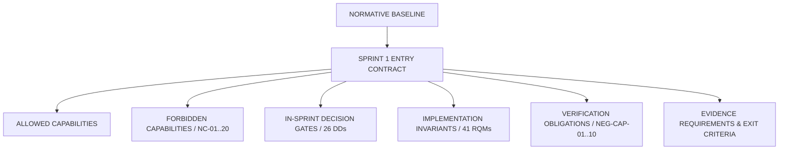
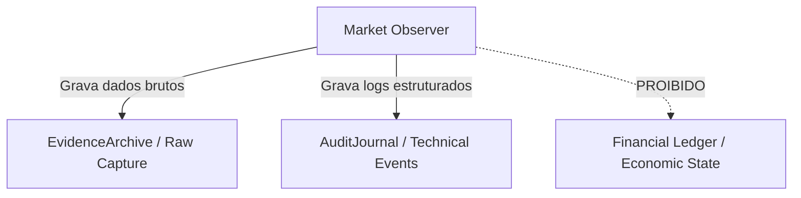

# 0F-E — Sprint 1 Entry Contract (Market Observer)

## 1. Executive Contract Summary

O presente documento estabelece o **Contrato de Entrada, Implementação e Aceitação** formal para o futuro **Sprint 1 — Market Observer** do projeto **BTG AI Trader**.

Este artefato realiza a consolidação normativa e a síntese rigorosa dos resultados aprovados nas etapas de fundação:
- **0F-A:** Consistência Normativa e Resolução de Autoridade;
- **0F-B:** Triagem de Decisões Deferidas, Ownership e Timing;
- **0F-C:** Matriz Canônica de Rastreabilidade, Implementabilidade e Testabilidade;
- **0F-D:** Gate de Segurança, Superfície Negativa e Princípio *Read-Only-by-Construction*.

### 1.1. Missão e Princípios do Contrato
A missão deste contrato é responder à pergunta: *«Qual é exatamente o contrato que deve governar a entrada, a implementação e a futura aceitação do Sprint 1 — Market Observer?»*

O contrato foi projetado para evitar simultaneamente dois modos de falha opostos:
1. **Under-Specification (Subespecificação):** O implementador receber um mandato vago (*«faça um Market Observer»*) e precisar criar ou inventar regras normativas e limites de segurança durante a codificação.
2. **Over-Specification (Superespecificação):** O contrato antecipar e congelar prematuramente tecnologias, provedores, bancos de dados ou parâmetros que foram formalmente e legitimamente classificados como `MAY_DECIDE_DURING_SPRINT_1` no gate 0F-B.

### 1.2. Estrutura em Três Camadas
O contrato está organizado em três camadas cronológicas e conceituais estritas:
- **Camada A — Entry Preconditions (Pré-condições de Entrada):** Condições mandatórias que devem estar 100% satisfeitas antes da abertura operacional do Sprint 1;
- **Camada B — During-Sprint Obligations (Obrigações Durante o Sprint):** Regras de implementação, invariantes semânticos, portões de decisão (*Decision Gates*) e restrições de composição e segurança que governam o desenvolvimento;
- **Camada C — Sprint-1 Exit / Acceptance Obligations (Critérios de Saída e Aceitação):** Requisitos de evidência auditável, testes automatizados, verificação estática e inspeção que condicionam a aprovação do Sprint 1.

### 1.3. Princípio Fundamental de Autoridade
> [!IMPORTANT]
> **0F-E_PASS ≠ SPRINT1_AUTHORIZED**
> O gate 0F-E atesta a completude, coerência e suficiência do *Contrato de Entrada*. A emissão da autorização formal de abertura do Sprint 1 é de competência **exclusiva e reservada ao Foundation Final Gate (0F-F)**.
> Existem atualmente **4 PRE_SPRINT1_ACTIONS** herdadas abertas (A-F01, A-F02, A-F03, B-F01). Elas figuram como pré-condições mandatórias de entrada e deverão ser satisfeitas antes do início efetivo das atividades do Sprint 1.

---

## 2. Baseline Verification

A integridade do repositório foi verificada antes da elaboração do presente contrato:

```yaml
AUDITED_COMMIT: 2b786ad6727e3bb9cdce07cbf084ff59e24926ca
BRANCH: main
HEAD_MATCHES_EXPECTED_BASELINE: YES
WORKTREE_CLEAN: YES
MATERIAL_REPOSITORY_DRIFT: NO
REPOSITORY_STATE: READ_ONLY_VERIFIED
```

---

## 3. Approved Inputs (Resultados Consolidados)

O presente contrato consome diretamente os resultados aprovados das tarefas 0F-A, 0F-B, 0F-C e 0F-D, sem reauditoria do zero:

1. **0F-A (Normative & Cross-Sprint Consistency):**
   - `0F-A_RESULT = PASS_WITH_PRE_SPRINT1_DOCUMENTATION_ACTIONS`
   - Hierarquia normativa consolidada; 0 conflitos normativos; 0 colisões de autoridade.
   - Ações pré-Sprint 1 preservadas: `A-F01` (Normative vs Implementation Reality), `A-F02` (Correção README Sprint 0 choices), `A-F03` (Snapshot 0E-H).
2. **0F-B (Deferred Decisions, Ownership & Stage Triage):**
   - `0F-B_RESULT = PASS_WITH_PRE_SPRINT1_ACTIONS`
   - 124 decisões normalizadas (141 itens de origem mapeados); 0 decisões bloqueantes não resolvidas.
   - `MUST_DECIDE_BEFORE_SPRINT_1 = 0` | `MAY_DECIDE_DURING_SPRINT_1 = 26` | `MAY_DEFER_BEYOND_SPRINT_1 = 50` | `MUST_REMAIN_UNDECIDED_NOW = 48`.
   - Ação pré-Sprint 1 preservada: `B-F01` (Correção config/README sobre escolha prematura de formato).
3. **0F-C (Traceability, Implementability & Testability):**
   - `0F-C_RESULT = PASS`
   - 41 requisitos normalizados (`RQM-001` a `RQM-041`) constituem a matriz canônica do Sprint 1 (30 diretamente testáveis, 11 testáveis pós-decisão).
   - 269 HQIs mapeados (27 aplicáveis ao Sprint 1, 242 não aplicáveis).
   - 15 QPIs mapeados (7 aplicáveis ao Sprint 1, 8 não aplicáveis).
4. **0F-D (Safety & Negative-Capability Gate):**
   - `0F-D_RESULT = PASS`
   - 20 Negative Capabilities formalizadas (`NC-01` a `NC-20`).
   - 10 Obrigações de Testes Negativos (`NEG-CAP-01` a `NEG-CAP-10`).
   - `CURRENT_BASELINE_READ_ONLY_BY_CONSTRUCTION = TRUE` (provado fisicamente).
   - `SPRINT1_REQUIRED_READ_ONLY_BY_CONSTRUCTION = TRUE` & `SPRINT1_REQUIRED_CAPABILITY_ESCALATION = STRUCTURAL_ESCALATION`.

---

## 4. Contract Principles

O Contrato de Entrada estabelece uma cadeia causal e estrita de governança:



### Princípios Operacionais:
1. **Allowed ≠ Required:** `ALLOWED_CAPABILITY ≠ MANDATORY_DELIVERABLE`. O escopo positivo define o envelope de capacidades permitidas. Apenas capacidades classificadas como `REQUIRED_CORE` ou `REQUIRED_IF_TRIGGERED` (cujo trigger ocorra) são entregáveis obrigatórios do Sprint 1.
2. **Decision Deadline:** `DECISION_DEADLINE = BEFORE_FIRST_MATERIAL_DEPENDENCY`. Nenhuma decisão classificada como `MAY_DECIDE_DURING_SPRINT_1` pode ser postergada para depois da implementação do primeiro componente que dependa materialmente dela.
3. **Proibição de Decisão Silenciosa:** `NO_SILENT_IMPLEMENTATION_DECISION`. Se a implementação encontrar uma bifurcação de design não coberta por DD existente, a codificação deve ser interrompida (`IMPLEMENTATION_MUST_STOP_FOR_CLASSIFICATION`).
4. **Conjunctive Safety:** A segurança do Sprint 1 é conjuntiva e não compensatória. Uma violação em qualquer termo de segurança invalida a aceitação.
5. **Fail-Closed:** Incerteza, anomalia de dados ou falha de feed impõe estado fail-closed no Observer, emitindo alertas/quarantine e rejeitando suposições otimistas.

---

## 5. Entry Preconditions (Camada A)

As 9 pré-condições de entrada (`EP-01` a `EP-09`) definem o portão de controle para a abertura do Sprint 1:

| Precondition ID | Título | Requisito Normativo | Evidência Exigida | Status Atual | Consequência de Falha |
|:---|:---|:---|:---|:---|:---|
| **EP-01** | Foundation Final Gate 0F-F | Aprovação formal de 0F-F com autorização humana e técnica | Registro de gate 0F-F aprovado | `OPEN` (aguardando 0F-F) | `BLOCK_SPRINT1_ENTRY` |
| **EP-02** | Baseline Git Estável | Commit de abertura identificado, verificado e rastreável | Hash Git no manifesto de abertura | `READY` (auditado) | `BLOCK_SPRINT1_ENTRY` |
| **EP-03** | Fechamento A-F01 | Clarificação normativa de autoridade vs realidade de implementação | Commit com atualização de docs aplicáveis | `OPEN` (PRE_SPRINT1_ACTION) | `BLOCK_SPRINT1_ENTRY` |
| **EP-04** | Fechamento A-F02 | Correção do README sobre escolha de bibliotecas/storage no Sprint 0 | Commit com correção do README | `OPEN` (PRE_SPRINT1_ACTION) | `BLOCK_SPRINT1_ENTRY` |
| **EP-05** | Fechamento A-F03 | Marcação de NEXT_ACTION do 0E-H como snapshot histórico | Commit com anotação em 0E-H | `OPEN` (PRE_SPRINT1_ACTION) | `BLOCK_SPRINT1_ENTRY` |
| **EP-06** | Fechamento B-F01 | Correção de config/README.md sobre formato e validação | Commit com ajuste em config/README.md | `OPEN` (PRE_SPRINT1_ACTION) | `BLOCK_SPRINT1_ENTRY` |
| **EP-07** | Zero Hard Blockers | Ausência total de hard blockers abertos acumulados da Fundação | Blocker ledger zerado em 0F-F | `SATISFIED` (0 blockers) | `BLOCK_SPRINT1_ENTRY` |
| **EP-08** | Zero Financial Capabilities | Ausência de qualquer código, credencial ou rota de negociação | Relatório de inspeção física 0F-D2 | `SATISFIED` (verificado 0F-D) | `BLOCK_SPRINT1_ENTRY` |
| **EP-09** | Escopo Restrito ao Observer | Escopo do Sprint 1 formalmente limitado a Market Observer read-only | Escopo positivado no Sprint Plan | `READY` (normatizado 0F-E) | `BLOCK_SPRINT1_ENTRY` |

---

## 6. Allowed Sprint 1 Capabilities (Escopo Positivo & Requirement Classes)

O Sprint 1 está normativamente autorizado a projetar, implementar e testar **exclusivamente** as seguintes capacidades de observação. Cada capacidade permitida possui uma classe formal de exigência (`CAPABILITY_REQUIREMENT_CLASS`):

| Capability ID | Capacidade Permitida | Requirement Class | Trigger de Ativação (se condicional) | Fonte Normativa | RQMs Vinculados | Escopo Permitido |
|:---|:---|:---|:---|:---|:---|:---|
| **AC-01** | Instrument Discovery & Resolution | `REQUIRED_CORE` | — (Mandatório universal) | ADR-0005, ADR-0006, Master Plan | RQM-020, RQM-040 | Descoberta e resolução de ativos negociáveis e contratos futuros point-in-time |
| **AC-02** | Provider Symbol / Reference Mapping | `REQUIRED_CORE` | — (Mandatório universal) | ADR-0005 | RQM-020 | Tradução causal `ProviderInstrumentRef → TradableInstrumentId` no escopo do provedor |
| **AC-03** | Provider Capability Discovery | `REQUIRED_CORE` | — (Mandatório universal) | ADR-0006, ADR-0012 | RQM-028 | Consulta estruturada às capacidades declaradas pelo provedor de dados |
| **AC-04** | Read-Only Provider Authentication | `REQUIRED_IF_TRIGGERED` | Provedor selecionado sob DD-60 exige autenticação | ADR-0006, RQM-036 | RQM-018, RQM-036 | Autenticação read-only sem credenciais de negociação |
| **AC-05** | Read-Only Market-Data Subscription | `REQUIRED_CORE` | — (Mandatório universal) | ADR-0006, Master Plan | RQM-021, RQM-028 | Subscrição e streaming de dados de mercado (L1/L2) |
| **AC-06** | Read-Only Historical Request | `PERMITTED_OPTIONAL` | — (Opcional se feed operar via streaming) | ADR-0006, Master Plan | RQM-024 | Requisição de séries históricas de candles/ticks com declaração de fidelidade |
| **AC-07** | Tick & Candle Observation | `REQUIRED_CORE` | — (Mandatório universal) | ADR-0004, ADR-0006 | RQM-001, RQM-038 | Ingestão e validação estrutural de ticks e candles observados em tempo real |
| **AC-08** | Heartbeat & Liveness Monitoring | `REQUIRED_CORE` | — (Mandatório universal) | ADR-0011, ADR-0020 | RQM-022, RQM-033 | Monitoramento de conectividade e detecção de dados obsoletos (staleness) |
| **AC-09** | Observable Latency Measurement | `REQUIRED_CORE` | — (Mandatório universal) | ADR-0004, ADR-0006 | RQM-023 | Medição de latência de ingestão e trânsito com relógio monotônico |
| **AC-10** | Quality Evidence & Admission Checks | `REQUIRED_CORE` | — (Mandatório universal) | ADR-0012, ADR-0015 | RQM-021, RQM-024 | Validação determinística de integridade de preços, volumes e spreads |
| **AC-11** | Invalid Event Quarantine | `REQUIRED_CORE` | — (Mandatório universal) | ADR-0012 | RQM-025, RQM-026 | Isolamento de eventos corrompidos/fora de ordem em canal de quarantine preservando payload |
| **AC-12** | Capture Context & Provenance | `REQUIRED_CORE` | — (Mandatório universal) | ADR-0013, ADR-0015, ADR-0021 | RQM-012, RQM-015, RQM-017 | Rastreabilidade completa de versão, hash de configuração e identidade de execução |
| **AC-13** | Minimum Technical Evidence Persistence | `REQUIRED_CORE` | — (Mandatório universal) | ADR-0009, ADR-0018 | RQM-029, RQM-030 | Gravação imutável em EvidenceArchive e AuditJournal (estritamente não-financeiro) |
| **AC-14** | Telemetry, Deduplication & Backpressure | `REQUIRED_CORE` | — (Mandatório universal) | ADR-0006, ADR-0013 | RQM-007, RQM-027, RQM-034 | Fila finita, backpressure observável sem descarte silencioso e deduplicação de ticks |

---

## 7. Prohibited Capabilities (Escopo Negativo / 0F-D)

As 20 capacidades negativas formalizadas em 0F-D são integralmente incorporadas ao contrato. É terminantemente proibida a introdução de qualquer uma delas no Sprint 1:

| Negative Capability ID | Capacidade Proibida | Fonte Normativa | Classificação de Risco | Consequência |
|:---|:---|:---|:---|:---|
| **NC-01** | Strategy Decision Capability | ADR-0007, ADR-0016, RQM-035 | `CRITICAL_SAFETY_VIOLATION` | `FAIL_SPRINT1_ACCEPTANCE` |
| **NC-02** | Operational TradeIntent Construction | ADR-0007, ADR-0016, RQM-035 | `CRITICAL_SAFETY_VIOLATION` | `FAIL_SPRINT1_ACCEPTANCE` |
| **NC-03** | Risk Authorization Engine | ADR-0016, RQM-035 | `CRITICAL_SAFETY_VIOLATION` | `FAIL_SPRINT1_ACCEPTANCE` |
| **NC-04** | Order Intent Generation | ADR-0007, ADR-0016, RQM-035 | `CRITICAL_SAFETY_VIOLATION` | `FAIL_SPRINT1_ACCEPTANCE` |
| **NC-05** | Order Plan Construction | ADR-0016, RQM-035 | `CRITICAL_SAFETY_VIOLATION` | `FAIL_SPRINT1_ACCEPTANCE` |
| **NC-06** | Execution Order Generation | ADR-0016, RQM-035 | `CRITICAL_SAFETY_VIOLATION` | `FAIL_SPRINT1_ACCEPTANCE` |
| **NC-07** | Order Side Effect (`order_send`, etc.) | AGENTS.md, SAFETY.md, RQM-035 | `CRITICAL_SAFETY_VIOLATION` | `FAIL_SPRINT1_ACCEPTANCE` |
| **NC-08** | Economic Commitment Path | ADR-0016, ADR-0022, RQM-035 | `CRITICAL_SAFETY_VIOLATION` | `FAIL_SPRINT1_ACCEPTANCE` |
| **NC-09** | Economic Recognition / Ledger Mutation | ADR-0014, ADR-0022, RQM-035 | `CRITICAL_SAFETY_VIOLATION` | `FAIL_SPRINT1_ACCEPTANCE` |
| **NC-10** | Trading Credentials Consumption | AGENTS.md, SAFETY.md, RQM-036 | `CRITICAL_SAFETY_VIOLATION` | `FAIL_SPRINT1_ACCEPTANCE` |
| **NC-11** | Execution API Binding | AGENTS.md, SAFETY.md, RQM-035 | `CRITICAL_SAFETY_VIOLATION` | `FAIL_SPRINT1_ACCEPTANCE` |
| **NC-12** | Market Data → Execution Path | ADR-0007, ADR-0016, RQM-037 | `CRITICAL_SAFETY_VIOLATION` | `FAIL_SPRINT1_ACCEPTANCE` |
| **NC-13** | Manual Trading Interface | AGENTS.md, SAFETY.md, RQM-035 | `CRITICAL_SAFETY_VIOLATION` | `FAIL_SPRINT1_ACCEPTANCE` |
| **NC-14** | UI Click / Desktop Automation | AGENTS.md | `CRITICAL_SAFETY_VIOLATION` | `FAIL_SPRINT1_ACCEPTANCE` |
| **NC-15** | Paper Execution Engine | AGENTS.md, ADR-0008, RQM-035 | `CRITICAL_SAFETY_VIOLATION` | `FAIL_SPRINT1_ACCEPTANCE` |
| **NC-16** | ML / Strategy Production Wiring | AGENTS.md, ADR-0016, RQM-035 | `CRITICAL_SAFETY_VIOLATION` | `FAIL_SPRINT1_ACCEPTANCE` |
| **NC-17** | Auto-Flatten / Emergency Orders | ADR-0011, ADR-0020, RQM-035 | `CRITICAL_SAFETY_VIOLATION` | `FAIL_SPRINT1_ACCEPTANCE` |
| **NC-18** | Financial Account Mutation | AGENTS.md, ADR-0022, RQM-035 | `CRITICAL_SAFETY_VIOLATION` | `FAIL_SPRINT1_ACCEPTANCE` |
| **NC-19** | Execution-Capable Scheduler / Job | AGENTS.md, SAFETY.md | `CRITICAL_SAFETY_VIOLATION` | `FAIL_SPRINT1_ACCEPTANCE` |
| **NC-20** | Hidden Trading Escape Hatch | AGENTS.md, SAFETY.md, RQM-035 | `CRITICAL_SAFETY_VIOLATION` | `FAIL_SPRINT1_ACCEPTANCE` |

---

## 8. Read-Only-By-Construction Contract

O contrato impõe que a arquitetura do Sprint 1 mantenha a propriedade formal `READ_ONLY_BY_CONSTRUCTION` como invariante estrutural.

### 8.1. Fórmula Conjuntiva de Segurança
A aceitação do Sprint 1 exige a satisfação estrita de todos os termos:

```
SPRINT1_SAFETY_CONTRACT_SATISFIED =
    READ_ONLY_BY_CONSTRUCTION
AND STRUCTURAL_ESCALATION
AND NO_TRADING_CREDENTIAL
AND NO_EXECUTION_AUTHORITY
AND NO_ORDER_SIDE_EFFECT
AND NO_FINANCIAL_COMMITMENT_PATH
AND NO_MARKET_DATA_TO_EXECUTION_PATH
AND NO_CONFIG_ESCAPE_HATCH
AND NO_PAPER_EXECUTION
AND NO_AUTO_FLATTEN
```

Se qualquer um dos termos falhar:
```
SPRINT1_SAFETY_CONTRACT_SATISFIED = FALSE
PROPOSED_RESULT = FAIL_SPRINT1_ACCEPTANCE
```

### 8.2. Barreira de Escalada de Capacidade
O contrato exige que a transição do estado estritamente passivo (Observer) para qualquer estado de execução financeira futura exija **reestruturação arquitetural e de código (STRUCTURAL_ESCALATION)**, sendo impossível de ser ativada por:
- Alteração de variáveis de ambiente;
- Alteração de arquivos de configuração;
- Injeção de flags de linha de comando;
- Substituição simples de credenciais (credential swap);
- Reconfiguração de wiring existente sem novo código auditado.

---

## 9. Provider / SDK Dual-Use Admissibility Contract

A baseline 0F-D estabelece o princípio fundamental:
> `SDK PACKAGE PRESENCE ≠ EXECUTION CAPABILITY`

A escolha de um provedor de market data que utilize um SDK de uso misto (dual-use) é **admissível SOMENTE SE** o adapter e o runtime satisfizerem cumulativamente as **11 condições mandatórias**:

1. **Domain-Facing Interface Exclusivamente Read-Only:** A interface exposta ao domínio do BTG AI Trader deve conter apenas métodos de observação, streaming e metadados.
2. **Métodos de Execução Não Expostos:** Nenhum método transacional (`order_send`, `order_calc_margin`, etc.) pode ser acessível através da camada de serviço do Observer.
3. **Interface de Execução Não Injetável:** O container de injeção de dependências do Observer não pode conter slots para interfaces de roteamento de ordens.
4. **Zero Trading via Configuração:** Nenhuma chave de configuração pode ativar rotas ou métodos de negociação.
5. **Autoridade de Credencial Restrita a Read-Only:** Quando a plataforma suportar, as credenciais utilizadas devem ser restritas a permissões de consulta e cotação.
6. **Observer Não Consome Credenciais de Trading:** O Observer é estruturalmente desacoplado de senhas de negociação e certificados transacionais.
7. **Economic Authority Nula:** `ECONOMIC_AUTHORITY = NONE` em toda a árvore do Observer.
8. **Reachability Nula de Market Data para Execução:** Não existe caminho no grafo de chamadas que ligue o callback de dados de mercado a qualquer side-effect financeiro.
9. **Imunidade a Credential Swap:** A substituição de credenciais de cotação por credenciais de conta real não transforma o Observer em executor.
10. **Imunidade a Permission Change:** A ampliação de permissões remotas no broker não altera o comportamento do código em execução no Observer.
11. **Ausência de Caminhos Alternativos de Fiação:** O código de teste e utilitários não podem conter atalhos ocultos que permitam envio de ordens.

> [!CAUTION]
> Se a plataforma examinada durante o Sprint 1 não permitir o cumprimento dessas 11 condições, ela estará **formalmente rejeitada** pelo Contrato de Entrada.

---

## 10. During-Sprint Decision Gates (26 Decisões / 0F-B)

O conjunto canônico das **26 decisões** classificadas como `MAY_DECIDE_DURING_SPRINT_1` no 0F-B final é:

```
SPRINT1_DECISION_GATE_DD_SET = {
  DD-01, DD-02, DD-03, DD-04, DD-20, DD-21, DD-22, DD-26,
  DD-33, DD-36, DD-37, DD-40, DD-41, DD-43, DD-54, DD-56,
  DD-57, DD-58, DD-59, DD-60, DD-61, DD-62, DD-65, DD-67,
  DD-68, DD-79
}
```

### 10.1. Cláusula de Proibição de Decisão Silenciosa
```
NO_SILENT_IMPLEMENTATION_DECISION = TRUE
```
Caso a equipe de implementação encontre uma necessidade de escolha técnica, semântica ou arquitetural não contemplada no catálogo abaixo:
1. A implementação da funcionalidade dependente deve ser **imediatamente suspensa** (`IMPLEMENTATION_MUST_STOP_FOR_CLASSIFICATION`);
2. O item deve ser classificado formalmente em: `IMPLEMENTATION_DETAIL`, `FUTURE_POLICY`, `DELIBERATELY_DEFERRED` ou `NORMATIVE_CHANGE`;
3. Se for classificado como `NORMATIVE_CHANGE` ou decisão arquitetural material, exige a redação e aprovação de novo ADR em `docs/adr/` antes do prosseguimento.

### 10.2. Catálogo Canônico das 26 Decisões do Sprint 1

| DD_ID | Decisão Deferida | Epistemic Class | Timing Class | Owner Stage | First Dependent Capability | Decision Trigger | Source Latest Stage (0F-B) | Contract Latest Safe Decision Point | Mandatory For All | Conditional On Design Path | Evidência Exigida | ADR Exigido |
|:---|:---|:---|:---|:---|:---|:---|:---|:---|:---:|:---:|:---|:---|
| **DD-01** | Representação física de IDs (UUID, ULID, int, str) | `DELIBERATELY_DEFERRED` | `MAY_DECIDE_DURING_SPRINT_1` | `SPRINT_1` | Event Envelope / RunId | Criação dos primeiros modelos de dados | `SPRINT_1` | Definição dos tipos de identificadores em `src/` | YES | NO | Tipos de ID em `src/` com testes de parsing | NO |
| **DD-02** | Formato de serialização de eventos e mensagens | `DELIBERATELY_DEFERRED` | `MAY_DECIDE_DURING_SPRINT_1` | `SPRINT_1` | Persistência técnica / Fila | Serialização de payload estruturado em disco/wire | `SPRINT_2` | Primeira serialização estruturada de eventos | NO | YES | Testes roundtrip determinísticos de serialização | CONDITIONAL |
| **DD-03** | Framework de schema e validação de dados | `IMPLEMENTATION_DETAIL` | `MAY_DECIDE_DURING_SPRINT_1` | `SPRINT_1` | DTOs de Tick e Candle | Definição das classes de dados de mercado | `SPRINT_1` | Primeira modelagem de tipos de dados de domínio | YES | NO | Dependência em `pyproject.toml` e schemas tipados | NO |
| **DD-04** | Política de versionamento de schemas de eventos | `DELIBERATELY_DEFERRED` | `MAY_DECIDE_DURING_SPRINT_1` | `SPRINT_1` | Event Envelope Versioning | Necessidade de migração ou evolução de schema | `SPRINT_2` | Definição do schema de envelope de eventos | NO | YES | Schema com metadados de versão e testes | CONDITIONAL |
| **DD-20** | Tecnologia de banco de dados para persistência | `DELIBERATELY_DEFERRED` | `MAY_DECIDE_DURING_SPRINT_1` | `SPRINT_1` | Persistência estruturada do Observer | Adoção de database em vez de flat files | `SPRINT_2` | Implementação do storage estruturado | NO | YES | Módulo de storage isolado de ledger | YES |
| **DD-21** | Tecnologia de storage para EvidenceArchive | `DELIBERATELY_DEFERRED` | `MAY_DECIDE_DURING_SPRINT_1` | `SPRINT_1` | Gravação de arquivos raw | Arquivamento de dados brutos de mercado | `SPRINT_2` | Implementação da escrita append-only | YES | NO | Adapter de arquivo append-only imutável | CONDITIONAL |
| **DD-22** | Tecnologia de transporte e mensageria interna | `DELIBERATELY_DEFERRED` | `MAY_DECIDE_DURING_SPRINT_1` | `SPRINT_1` | Desacoplamento ingestão-processamento | Adoção de broker externo vs fila em memória | `SPRINT_9` | Implementação do canal de transporte interno | NO | YES | Fila finita com backpressure observável | YES |
| **DD-26** | Mecanismo de transação e atomicidade local | `IMPLEMENTATION_DETAIL` | `MAY_DECIDE_DURING_SPRINT_1` | `SPRINT_1` | Gravação consistente de logs/evidência | Exigência de atomicidade física em batches | `SPRINT_2` | Implementação de flush atômico de evidências | NO | YES | Teste de flush atômico e integridade | NO |
| **DD-33** | Catálogo formal de capacidades de provedores | `DELIBERATELY_DEFERRED` | `MAY_DECIDE_DURING_SPRINT_1` | `SPRINT_1` | `MarketDataProvider` contract | Instanciação da interface de provedor | `SPRINT_1` | Modelagem da interface base do adapter | YES | NO | Enum/dataclass de `ProviderCapabilities` | NO |
| **DD-36** | Catálogo físico de enums RuntimePhase/Safety | `IMPLEMENTATION_DETAIL` | `MAY_DECIDE_DURING_SPRINT_1` | `SPRINT_1` | Ciclo de vida do Observer | Modelagem de estados operacionais do Observer | `SPRINT_2` | Definição das fases e posturas do Observer | YES | NO | Enums canônicos em `src/` conforme RQM-032 | NO |
| **DD-37** | Limiares de segurança e degradação de feed | `FUTURE_POLICY` | `MAY_DECIDE_DURING_SPRINT_1` | `SPRINT_1` | Heartbeat & Liveness | Lógica de detecção de desconexão/staleness | `SPRINT_7` | Implementação dos limites de staleness | YES | NO | Configuração de timeouts e testes | NO |
| **DD-40** | Formato físico e schema do RunManifest | `IMPLEMENTATION_DETAIL` | `MAY_DECIDE_DURING_SPRINT_1` | `SPRINT_1` | Metadados de execução do Observer | Primeira execução funcional de captura | `SPRINT_1` | Implementação do gerador de manifesto | YES | NO | Schema do `RunManifest` e testes | NO |
| **DD-41** | Representação canônica universal de versões | `IMPLEMENTATION_DETAIL` | `MAY_DECIDE_DURING_SPRINT_1` | `SPRINT_1` | `CaptureContext` | Registro de proveniência de código | `SPRINT_1` | Modelagem do CaptureContext | YES | NO | Extração de Git SHA e testes no contexto | NO |
| **DD-43** | Gerenciamento de credenciais read-only | `DELIBERATELY_DEFERRED` | `MAY_DECIDE_DURING_SPRINT_1` | `SPRINT_1` | Autenticação no feed de dados | Provedor selecionado sob DD-60 requer credenciais | `SPRINT_1` | Implementação do adapter autenticado | NO | YES | Leitura segura via env/vault sem leak em logs | CONDITIONAL |
| **DD-54** | Mecanismo de concorrência em I/O (async/threads) | `IMPLEMENTATION_DETAIL` | `MAY_DECIDE_DURING_SPRINT_1` | `SPRINT_1` | Loop de streaming de market data | Codificação do worker de ingestão | `SPRINT_1` | Implementação do loop de streaming | YES | NO | Código concorrente e testes de carga | NO |
| **DD-56** | Calendário B3 e feriados | `DELIBERATELY_DEFERRED` | `MAY_DECIDE_DURING_SPRINT_1` | `SPRINT_1` | Validação de sessão de mercado | Filtragem explícita de calendário no Observer | `SPRINT_2` | Implementação de validações de pregão | NO | YES | Testes de conversão temporal B3 | NO |
| **DD-57** | Tolerância para reordenação de eventos | `FUTURE_POLICY` | `MAY_DECIDE_DURING_SPRINT_1` | `SPRINT_1` | Ingestão com skew de rede | Adoção de buffer de reordenação vs anotação | `SPRINT_2` | Tratamento de ticks fora de ordem | NO | YES | Testes de preservação de arrival time | NO |
| **DD-58** | Implementação de Instrument Registry | `DELIBERATELY_DEFERRED` | `MAY_DECIDE_DURING_SPRINT_1` | `SPRINT_1` | Subscrição e correlação de ativos | Mapeamento de símbolos de mercado | `SPRINT_1` | Implementação do catálogo de ativos | YES | NO | Módulo `InstrumentRegistry` e testes | NO |
| **DD-59** | Políticas de deduplicação e backpressure | `IMPLEMENTATION_DETAIL` | `MAY_DECIDE_DURING_SPRINT_1` | `SPRINT_1` | Pipeline de ingestão | Dimensionamento da fila sob saturação de dados | `SPRINT_1` | Implementação da fila de ingestão | YES | NO | Fila finita e testes de backpressure | NO |
| **DD-60** | Provedor de Market Data inicial | `DELIBERATELY_DEFERRED` | `MAY_DECIDE_DURING_SPRINT_1` | `SPRINT_1` | Adapter de conexão real | Seleção da fonte de dados de laboratório | `SPRINT_1` | Implementação do adapter concreto | YES | NO | ADR de escolha + conformidade 11 regras | YES |
| **DD-61** | Compatibilidade Python 3.12 com MT5 | `DELIBERATELY_DEFERRED` | `MAY_DECIDE_DURING_SPRINT_1` | `SPRINT_1` | Conexão MT5 em Windows | DD-60 seleciona MetaTrader 5 | `SPRINT_1` | Spike técnico de conexão com MT5 | NO | YES | Relatório de compatibilidade e testes de import | NO |
| **DD-62** | Canais de quarantine para eventos inválidos | `IMPLEMENTATION_DETAIL` | `MAY_DECIDE_DURING_SPRINT_1` | `SPRINT_1` | Tratamento de anomalias/corrupção | Validação de sanidade de ticks/candles | `SPRINT_2` | Implementação do canal de quarantine | YES | NO | Canal de quarantine e testes com bad payload | NO |
| **DD-65** | Formato e validação de configuração | `IMPLEMENTATION_DETAIL` | `MAY_DECIDE_DURING_SPRINT_1` | `SPRINT_1` | Parametrização do Observer | Criação dos arquivos de configuração | `SPRINT_1` | Definição da estrutura de configuração | YES | NO | Schema de config tipado e validação | NO |
| **DD-67** | Representação numérica (preço/volume) | `DELIBERATELY_DEFERRED` | `MAY_DECIDE_DURING_SPRINT_1` | `SPRINT_1` | DTOs de Tick e Candle | Tipagem de preços e quantidades | `SPRINT_1` | Modelagem dos campos numéricos | YES | NO | Tipos numéricos definidos e testes de precisão | CONDITIONAL |
| **DD-68** | Instrumento do primeiro laboratório | `FUTURE_POLICY` | `MAY_DECIDE_DURING_SPRINT_1` | `SPRINT_1` | Execução experimental integrada | Parametrização da primeira captura | `SPRINT_1` | Configuração da sessão experimental | YES | NO | Configuração declarada de símbolo/timeframe | NO |
| **DD-79** | Limiares de tolerância a gaps e outliers | `FUTURE_POLICY` | `MAY_DECIDE_DURING_SPRINT_1` | `SPRINT_1` | Métricas de integridade de dados | Ativação de filtros estatísticos avançados | `SPRINT_2` | Implementação de filtros de salto de preço | NO | YES | Testes de detecção de saltos absurdos | NO |

---

## 11. RQM Contract Mapping (41 Requisitos / 0F-C)

Todos os **41 requisitos normalizados** do Sprint 1 (`RQM-001` a `RQM-041`) são mapeados para cláusulas contratuais, fases de execução, dependências canônicas de 0F-C e evidências requeridas:

| RQM_ID | Cláusula Contratual | Fase do Sprint | Mandatory | Canonical Related DD (0F-C) | Contract Implementation Dependency | Modo de Verificação | Evidência Esperada na Aceitação | Status na Entrada |
|:---|:---|:---|:---|:---|:---|:---|:---|:---|
| **RQM-001** | `S1-EC-081` | `CORE_DESIGN` | YES | — | DD-03, DD-67 | `UNIT_TEST` / `PROPERTY_TEST` | DTOs com `event_time`, `ingestion_time`, `knowledge_time` separados | `UNIMPLEMENTED` |
| **RQM-002** | `S1-EC-082` | `CORE_DESIGN` | YES | — | DD-03, DD-56 | `UNIT_TEST` / `STATIC_ANALYSIS` | Timezone awareness explícito (UTC/B3); zero `datetime` naive | `UNIMPLEMENTED` |
| **RQM-003** | `S1-EC-083` | `INGESTION` | YES | — | DD-03, DD-67 | `UNIT_TEST` | Preservação de dados ausentes como `UNKNOWN` (sem síntese) | `UNIMPLEMENTED` |
| **RQM-004** | `S1-EC-083` | `INGESTION` | YES | — | DD-03, DD-67 | `UNIT_TEST` | Distinção explícita entre valor zero (`0.0`) e valor ausente | `UNIMPLEMENTED` |
| **RQM-005** | `S1-EC-083` | `INGESTION` | YES | — | DD-03, DD-67 | `UNIT_TEST` | Metadados distinguem ausência de tick de volume zero negociado | `UNIMPLEMENTED` |
| **RQM-006** | `S1-EC-084` | `INGESTION` | YES | — | DD-03, DD-57 | `UNIT_TEST` | Ordenação desconhecida não é arbitrariamente sintetizada | `UNIMPLEMENTED` |
| **RQM-007** | `S1-EC-084` | `INGESTION` | YES | DD-01, DD-59 | — | `UNIT_TEST` / `PROPERTY_TEST` | Deduplicação idempotente de eventos com mesma chave canônica | `UNIMPLEMENTED` |
| **RQM-008** | `S1-EC-085` | `CORE_DESIGN` | YES | DD-01, DD-02, DD-03 | — | `UNIT_TEST` | Envelope de eventos com metadados canônicos completos | `UNIMPLEMENTED` |
| **RQM-009** | `S1-EC-085` | `CORE_DESIGN` | YES | — | DD-01, DD-04 | `UNIT_TEST` | `source_sequence` exige `sequence_scope` para ordenação causal | `UNIMPLEMENTED` |
| **RQM-010** | `S1-EC-085` | `CORE_DESIGN` | YES | DD-03, DD-04 | — | `UNIT_TEST` | Schema compatibility declarada; falha fechada sem fallback silencioso | `UNIMPLEMENTED` |
| **RQM-011** | `S1-EC-085` | `CORE_DESIGN` | YES | — | DD-01 | `UNIT_TEST` | Fatos exógenos não recebem `correlation_id` sintético | `UNIMPLEMENTED` |
| **RQM-012** | `S1-EC-086` | `PROVENANCE` | YES | DD-40, DD-41 | — | `UNIT_TEST` / `AUDIT_EVIDENCE` | Identidade de input e proveniência imutáveis por Run | `UNIMPLEMENTED` |
| **RQM-013** | `S1-EC-086` | `PROVENANCE` | YES | DD-41 | — | `UNIT_TEST` | Aliases mutáveis (`latest`) proibidos como identificadores estáveis | `UNIMPLEMENTED` |
| **RQM-014** | `S1-EC-086` | `PROVENANCE` | YES | DD-40 | DD-21, DD-62 | `UNIT_TEST` / `AUDIT_EVIDENCE` | Filtros e limpezas integram proveniência sem apagar dados brutos | `UNIMPLEMENTED` |
| **RQM-015** | `S1-EC-087` | `PROVENANCE` | YES | DD-01, DD-40 | — | `UNIT_TEST` | Reinício de processo gera obrigatoriamente novo `RunId` único | `UNIMPLEMENTED` |
| **RQM-016** | `S1-EC-087` | `PROVENANCE` | YES | DD-40 | — | `UNIT_TEST` | Continuidade operacional registrada por `RunRelation` tipada | `UNIMPLEMENTED` |
| **RQM-017** | `S1-EC-086` | `PROVENANCE` | YES | DD-40, DD-41, DD-65 | — | `UNIT_TEST` / `AUDIT_EVIDENCE` | `CaptureContext` vincula run_id, git_sha, config_hash e provider | `UNIMPLEMENTED` |
| **RQM-018** | `S1-EC-075` | `SAFETY` | YES | DD-43 | — | `STATIC_ANALYSIS` / `SECURITY_SCAN` | Logs e proveniência nunca materializam credenciais/segredos | `UNIMPLEMENTED` |
| **RQM-019** | `S1-EC-088` | `PROVENANCE` | YES | — | DD-40 | `PROPERTY_TEST` | Grafo de linhagem derivacional entre artefatos é estritamente acíclico | `UNIMPLEMENTED` |
| **RQM-020** | `S1-EC-089` | `CORE_DESIGN` | YES | DD-58 | — | `UNIT_TEST` | Distinção entre `InstrumentFamily`, `TradableInstrument`, `ProviderRef` | `UNIMPLEMENTED` |
| **RQM-021** | `S1-EC-090` | `INGESTION` | YES | — | DD-03, DD-33 | `NEGATIVE_TEST` | Dados observados não conferem presunção de executabilidade | `UNIMPLEMENTED` |
| **RQM-022** | `S1-EC-090` | `INGESTION` | YES | DD-37, DD-60 | — | `UNIT_TEST` / `INTEGRATION_TEST` | Detecção de dados obsoletos (staleness) e heartbeat timeout | `UNIMPLEMENTED` |
| **RQM-023** | `S1-EC-090` | `INGESTION` | YES | DD-60 | DD-54 | `UNIT_TEST` | Medição de latência observável com relógio monotônico | `UNIMPLEMENTED` |
| **RQM-024** | `S1-EC-090` | `INGESTION` | YES | DD-33, DD-60 | DD-03 | `UNIT_TEST` | Declaração explícita de `FidelityMode` e resolução de captura | `UNIMPLEMENTED` |
| **RQM-025** | `S1-EC-090` | `INGESTION` | YES | DD-62 | — | `UNIT_TEST` / `INTEGRATION_TEST` | Eventos de mercado inválidos isolados em canal de quarantine | `UNIMPLEMENTED` |
| **RQM-026** | `S1-EC-090` | `INGESTION` | YES | DD-57 | DD-62 | `UNIT_TEST` | Eventos tardios anotados sem sobrescrever ordem de chegada | `UNIMPLEMENTED` |
| **RQM-027** | `S1-EC-090` | `INGESTION` | YES | DD-54, DD-59 | — | `PROPERTY_TEST` / `LOAD_TEST` | Filas finitas com backpressure observável e sem descarte silencioso | `UNIMPLEMENTED` |
| **RQM-028** | `S1-EC-090` | `ADAPTERS` | YES | DD-33, DD-60 | — | `UNIT_TEST` | Interface do `MarketDataProvider` baseada em capacidades declaradas | `UNIMPLEMENTED` |
| **RQM-029** | `S1-EC-077` | `PERSISTENCE` | YES | DD-20, DD-21 | DD-26 | `UNIT_TEST` / `PROPERTY_TEST` | Imutabilidade e append-only de dados de mercado persistidos | `UNIMPLEMENTED` |
| **RQM-030** | `S1-EC-077` | `PERSISTENCE` | YES | DD-20, DD-21 | — | `ARCHITECTURAL_INSPECTION` | Separação lógica entre EvidenceArchive e AuditJournal | `UNIMPLEMENTED` |
| **RQM-031** | `S1-EC-077` | `PERSISTENCE` | YES | DD-20, DD-21 | — | `UNIT_TEST` | Correções posteriores não apagam o registro original conhecido | `UNIMPLEMENTED` |
| **RQM-032** | `S1-EC-091` | `RUNTIME` | YES | DD-36 | — | `UNIT_TEST` | Separação estrita: `RuntimePhase` ≠ `SafetyPosture` ≠ `Readiness` | `UNIMPLEMENTED` |
| **RQM-033** | `S1-EC-091` | `RUNTIME` | YES | DD-36 | — | `UNIT_TEST` | Liveness (processo vivo) não implica prontidão operacional | `UNIMPLEMENTED` |
| **RQM-034** | `S1-EC-091` | `RUNTIME` | YES | DD-36, DD-37 | — | `UNIT_TEST` / `AUDIT_EVIDENCE` | Transições de estado operacional são observáveis e auditáveis | `UNIMPLEMENTED` |
| **RQM-035** | `S1-EC-072` | `SAFETY` | YES | — | DD-60 | `NEGATIVE_TEST` / `STATIC_ANALYSIS` | Ausência total de capacidade de execução, ordens ou compromissos | `UNIMPLEMENTED` |
| **RQM-036** | `S1-EC-074` | `SAFETY` | YES | — | DD-43, DD-60 | `STATIC_ANALYSIS` / `SECURITY_SCAN` | Proibição de libs de execução e credenciais de trading em produção | `UNIMPLEMENTED` |
| **RQM-037** | `S1-EC-076` | `SAFETY` | YES | — | DD-60 | `NEGATIVE_TEST` | Ingestão ou análise de market data nunca cria autoridade de trading | `UNIMPLEMENTED` |
| **RQM-038** | `S1-EC-081` | `CORE_DESIGN` | YES | — | DD-03 | `UNIT_TEST` | Intervalo do candle, finalização e disponibilidade distintos | `UNIMPLEMENTED` |
| **RQM-039** | `S1-EC-081` | `CORE_DESIGN` | YES | — | DD-03 | `UNIT_TEST` | Dados derivados herdam restrições temporais dos dados ancestrais | `UNIMPLEMENTED` |
| **RQM-040** | `S1-EC-089` | `CORE_DESIGN` | YES | DD-58 | — | `UNIT_TEST` / `INTEGRATION_TEST` | Descoberta e resolução de contratos futuros point-in-time e causal | `UNIMPLEMENTED` |
| **RQM-041** | `S1-EC-092` | `PROVENANCE` | YES | DD-40, DD-65 | DD-41 | `AUDIT_EVIDENCE` / `FIXTURE_REPROCESSING_TEST` | Rastreabilidade de inputs e configuração de captura | `UNIMPLEMENTED` |

---

## 12. HQI / QPI Coverage (Preservação Canônica)

A rastreabilidade canônica aprovada no gate 0F-C é integralmente preservada:

### 12.1. Cobertura dos 27 HQIs Aplicáveis
Todos os **27 Hard Quantitative Invariants** aplicáveis ao Sprint 1 possuem cobertura direta através dos RQMs e das cláusulas deste contrato:
- **0E-A (2 HQIs):** `A-HQI-07` (RQM-021), `A-HQI-09` (RQM-037).
- **0E-B (21 HQIs):** `B-HQI-01` (RQM-012), `B-HQI-02` (RQM-012, RQM-017), `B-HQI-03` (RQM-001), `B-HQI-04` (RQM-001), `B-HQI-05` (RQM-003), `B-HQI-08` (RQM-039), `B-HQI-11` (RQM-038), `B-HQI-12` (RQM-004), `B-HQI-14` (RQM-005), `B-HQI-16` (RQM-040), `B-HQI-17` (RQM-021), `B-HQI-18` (RQM-031), `B-HQI-19` (RQM-012), `B-HQI-20` (RQM-013), `B-HQI-21` (RQM-014), `B-HQI-24` (RQM-001, RQM-039), `B-HQI-25` (RQM-002), `B-HQI-26` (RQM-006), `B-HQI-27` (RQM-007), `B-HQI-28` (RQM-014), `B-HQI-29` (RQM-024).
- **0E-D (4 HQIs):** `D-HQI-08` (RQM-021), `D-HQI-14` (RQM-023), `D-HQI-17` (RQM-021), `D-HQI-18` (RQM-021).
- **Não aplicáveis ao Sprint 1:** 242 HQIs (pertencentes a modelagem preditiva, backtesting, risco e execução nos Sprints 2 a 10).

### 12.2. Cobertura dos 7 QPIs Aplicáveis
Todos os **7 Quantitative Protocol Invariants** transversais aplicáveis ao Sprint 1 são cobertos:
- `QPI-01` (*Claim Strength ≤ Evidence Strength*): Coberto por `RQM-024` e cláusula `S1-EC-090` (`FidelityMode` explícito);
- `QPI-02` (*Knowledge Must Be Causal*): Coberto por `RQM-001`, `RQM-002`, `RQM-038`, `RQM-039` e cláusulas `S1-EC-081`, `S1-EC-082`;
- `QPI-05` (*Observed Market ≠ Executable Market*): Coberto por `RQM-021` e cláusula `S1-EC-090`;
- `QPI-11` (*Unknown Must Remain Unknown*): Coberto por `RQM-003`, `RQM-004`, `RQM-005`, `RQM-006` e cláusula `S1-EC-083`;
- `QPI-12` (*Version & Provenance Are Immutable Historically*): Coberto por `RQM-012..017`, `RQM-019`, `RQM-029`, `RQM-031` e cláusulas `S1-EC-077`, `S1-EC-086`, `S1-EC-087`;
- `QPI-13` (*Evaluation ≠ Promotion ≠ Authority*): Coberto por `RQM-035`, `RQM-037` e cláusulas `S1-EC-072`, `S1-EC-076`;
- `QPI-15` (*Gates Are Fail-Closed and Conjunctive*): Coberto pela cláusula `S1-EC-078` e governança transversal de gates.
- **Não aplicáveis ao Sprint 1:** 8 QPIs (`QPI-03`, `04`, `06`, `07`, `08`, `09`, `10`, `14`).

---

## 13. Verification Contract (Contrato de Verificação)

A verificação das entregas do Sprint 1 será regida por uma taxonomia estrita de testes automatizados e inspeções formais, sem seleção prematura de bibliotecas de teste:

| Categoria de Verificação | Descrição e Escopo | Oráculos e Mecanismos | Cláusulas de Verificação |
|:---|:---|:---|:---|
| **UNIT** | Testes unitários determinísticos de tipos, DTOs, validadores, parsers e lógicas puras | Asserções exatas, schemas tipados validados, conversões de timezone | `S1-EC-103` |
| **NEGATIVE** | Testes de falha deliberada e rejeição de entradas corrompidas ou operações proibidas | Rejeição de eventos malformados, barreira contra criação de ordens | `S1-EC-093` a `S1-EC-102` |
| **PROPERTY** | Testes baseados em propriedades para invariantes fundamentais (mecanismo selecionado no Sprint 1 se requerido) | Monotonicidade de relógio, idempotência de deduplicação, roundtrip de serialização | `S1-EC-104` |
| **INTEGRATION** | Testes de integração em bordas de I/O com mocks determinísticos e feeds reais/sandbox | Streaming de ticks, buffer de backpressure, gravação em filesystem local | `S1-EC-105` |
| **STATIC_ANALYSIS** | Análise estática de código (AST, linter, typechecker) para detecção de chamadas ou imports proibidos | AST visitor verificando ausência de `order_send`, tipagem estrita | `S1-EC-106` |
| **REPOSITORY_INSPECTION** | Varredura física de arquivos, variáveis de ambiente, dependências e configurações | Scripts de auditoria conferindo ausência de credenciais e dependências de trading | `S1-EC-107` |
| **AUDIT_EVIDENCE** | Geração e validação de manifestos de execução (`RunManifest`), journals e hashes | Inspeção de arquivos estruturados de proveniência gerados pelo Observer | `S1-EC-107` |

---

## 14. Negative-Capability Test Contract (NEG-CAP-01 a NEG-CAP-10)

O Sprint 1 deve implementar **obrigatoriamente** os 10 testes de capacidade negativa definidos em 0F-D como suíte de regressão de segurança automatizada:

| Test ID | Obrigação de Teste Negativo | Racional de Segurança | Cláusula Vinculada | Critério de Aceitação |
|:---|:---|:---|:---|:---|
| **NEG-CAP-01** | Nenhum `OrderIntent` operacional pode ser construído a partir das saídas do Observer | O Observer produz apenas observações/evidências, nunca propostas de trading | `S1-EC-093` | Falha estática ou runtime ao tentar converter Tick/Candle em OrderIntent |
| **NEG-CAP-02** | Nenhuma interface de execução é injetável em componentes do Observer | A injeção de dependências do Observer deve rejeitar tipos executores | `S1-EC-094` | Container de DI rejeita acoplamento com interfaces de execução |
| **NEG-CAP-03** | Nenhum evento de market data alcança side-effect transacional | Garante RQM-037: ingestão de dados nunca cria autoridade de trading | `S1-EC-095` | Grafo de chamadas de ingestão termina em persistência técnica |
| **NEG-CAP-04** | Nenhuma configuração de runtime habilita negociação | Nenhuma flag de config, env var ou arquivo ativa execução | `S1-EC-096` | Scanner de config comprova ausência total de flags de execução |
| **NEG-CAP-05** | Nenhuma credencial de trading é requerida ou consumida | Observer opera sem credenciais transacionais; autoridade estritamente read-only | `S1-EC-097` | Execução do Observer passa sem variáveis de trading no ambiente |
| **NEG-CAP-06** | Adapter read-only não expõe operações de trading; métodos de SDK dual-use inacessíveis | Adapter limita-se a subscrição/cotação; SDK dual-use isolado estruturalmente | `S1-EC-098` | Métodos transacionais do SDK não são alcançáveis a partir do Observer |
| **NEG-CAP-07** | `SAFE_HALT` não gera side-effect financeiro nem auto-flatten | Fail-closed significa bloquear novos compromissos; observação contínua segue política de runtime | `S1-EC-099` | Degradação para SAFE_HALT produz zero ordens de zeragem ou transações |
| **NEG-CAP-08** | Nenhuma rota CLI/UI/admin expõe buy/sell/cancel/flatten | Zero comandos de trading manual disponíveis no sistema | `S1-EC-100` | Inspeção de entrypoints confirma ausência de rotas de negociação |
| **NEG-CAP-09** | Escritas de persistência do Observer não alteram o ledger financeiro | Observer persiste apenas evidência técnica (EvidenceArchive/AuditJournal) | `S1-EC-101` | Tentativa de escrita do Observer em schema de ledger é rejeitada |
| **NEG-CAP-10** | Paper Execution ausente do Sprint 1 | Escopo do Sprint 1 é estritamente Market Observer, não simulação de ordens | `S1-EC-102` | Módulo de Paper Trading ausente do codebase no Sprint 1 |

---

## 15. Runtime Composition Contract

A composição de runtime do Market Observer deve respeitar limites rígidos de isolamento:
1. **Proibição de Referências de Execução:** O container de composição do Observer está proibido de carregar, referenciar ou injetar classes pertencentes aos seguintes domínios:
   - `StrategyEngine` / `SignalGenerator` (Sprint 4+);
   - `RiskEngine` / `RiskAuthorization` (Sprint 6+);
   - `OrderManager` / `ExecutionEngine` (Sprint 7+);
   - `FinancialLedger` / `PositionTracker` (Sprint 8+).
2. **Fronteira Permitida:** O domínio do Market Observer pode compor e depender exclusivamente de abstrações necessárias à:
   - Ingestão e subscrição de mercado (`MarketDataProvider`);
   - Descoberta e resolução de instrumentos (`InstrumentRegistry`);
   - Verificações mínimas de qualidade/admissão e canal de quarantine (`QuarantineChannel`);
   - Proveniência e contexto de execução (`CaptureContext`, `RunManifest`);
   - Persistência técnica mínima de evidências e logs de ciclo de vida (`EvidenceArchive`, `AuditJournal`);
   - Telemetria de integridade e liveness (`LatencyMetrics`, `LivenessProbe`).

---

## 16. Persistence Contract

O contrato de persistência preserva a separação arquitetural estrita definida no Master Plan e nos ADRs 0009 e 0018:



### 16.1. Planos de Persistência Permitidos no Sprint 1:
1. **EvidenceArchive:** Armazenamento append-only e imutável de observações de mercado (ticks, candles, snapshots de book). Implementado pelo mecanismo de persistência selecionado sob DD-20/DD-21, garantindo integridade e replayability futura.
2. **AuditJournal:** Registro cronológico estruturado de eventos técnicos de ciclo de vida do Observer (inicialização, conexão de feed, timeouts, anomalias de dados, transições de estado).

### 16.2. Plano de Persistência Proibido:
- **Financial Ledger:** O ledger financeiro (registro de saldo, posições abertas, P&L, margens) é **estritamente inacessível** ao Observer. Nenhuma tabela, coleção ou arquivo de estado financeiro pode ser instanciado ou modificado pelo Sprint 1.

---

## 17. Temporal & Instrument Semantics

### 17.1. Semântica Temporal Estrita (RQM-001 a RQM-006, RQM-038, RQM-039)
1. **Tríade Temporal Distinta:** Cada observação de mercado deve distinguir formalmente três campos temporais:
   - `event_time`: Tempo do evento sustentado/reportado pela fonte externa, com base/resolução/fidelidade quando disponíveis;
   - `ingestion_time`: Momento em que o evento foi recebido pelo adapter do Observer;
   - `knowledge_time`: Momento em que o dado foi validado e disponibilizado para consumo interno.
   *Nota:* O contrato não exige desigualdade numérica entre esses campos, mas impõe campos semânticos separados.
2. **Timezone Awareness:** Timestamps internos são representados em UTC quando aplicável, com conversão explícita para `America/Sao_Paulo` quando as regras de pregão B3 exigirem. `datetime` naive é estritamente proibido em boundaries críticos.
3. **Semântica de Dados Ausentes:**
   - Dados desconhecidos permanecem `UNKNOWN` (proibido sintetizar valores artificiais);
   - Dado ausente (`None` / `null`) ≠ valor zero (`0.0`);
   - Ausência de tick no feed ≠ volume zero negociado;
   - Ordenação desconhecida não pode ser inventada artificialmente.

### 17.2. Semântica de Identidade de Instrumentos (RQM-020, RQM-040)
1. **Tríade de Instrumentos:** O sistema deve distinguir formalmente:
   - `InstrumentFamily`: Família ou classe do ativo (ex: Mini Índice Futuro);
   - `TradableInstrumentId`: Identificador canônico interno do ativo;
   - `ProviderInstrumentRef`: Código de referência específico do provedor externo.
2. **Resolução Scoped Point-in-Time:** A resolução `ProviderInstrumentRef → TradableInstrumentId` deve ser não ambígua **exclusivamente dentro de**: `provedor`, `escopo/contexto de captura` e `intervalo de validade aplicável`. Não há exigência de bijeção global, mapeamento reverso global ou mapeamento atemporal.

---

## 18. Replay Boundary (Fronteira de Replay)

O contrato delimita com precisão a capacidade de simulação e replay através dos sprints do roadmap:

| Fase / Sprint | Capacidade de Replay Autorizada | Restrições Mandatórias |
|:---|:---|:---|
| **Sprint 1 (Market Observer)** | - Preserva evidências brutas, proveniência e timestamps para viabilizar replay futuro.<br>- Reprocessamento de fixtures estáticas em testes (`FIXTURE_REPROCESSING_TEST`). | **NÃO implementa** motor de replay, backtester nem feed simulado como capability de produção. |
| **Sprint 2 (Data Platform & Replay)** | - Motor formal de Replay de dados de mercado históricos com controle de velocidade e ordenação causal. | Replay estritamente de dados de mercado, sem execução de ordens ou modelos preditivos. |
| **Sprint 3 (Deterministic Backtesting)** | - Backtester econômico determinístico com simulação de custos, slippage, latência e fila. | Simulação econômica completa sob protocolo quantitativo 0E-E. |

---

## 19. Sprint 1 Deliverable Contract (Entregáveis Mínimos)

Para que o futuro Sprint 1 possa ser aceito, a implementação deverá produzir o seguinte conjunto de entregáveis mínimos necessários para o Market Observer, sem antecipar a Data Platform do Sprint 2:

| Deliverable ID | Componente / Capacidade | Fonte Normativa | RQMs Requeridos | Decisões Relacionadas | Testes Obrigatórios | Evidência de Auditoria | Impacto de Segurança | Critério de Aceitação |
|:---|:---|:---|:---|:---|:---|:---|:---|:---|
| **DELIV-S1-01** | Modelos de Dados de Domínio & Tipagem (`EventEnvelope`, `Tick`, `Candle`, `Instrument`, `Enums`) | ADR-0003, ADR-0004, ADR-0005, ADR-0015 | RQM-001..011, RQM-020, RQM-032, RQM-038, RQM-039 | DD-01, DD-03, DD-36, DD-67 | Unit Tests, Property Tests | Schemas tipados e testes green | `SAFE_PASSIVE` | Modelos em `src/` com tipagem estrita e validação sob framework escolhido em DD-03 |
| **DELIV-S1-02** | Instrument Registry & Scoped Symbol Mapping (`ProviderRef → TradableId`) | ADR-0005 | RQM-020, RQM-040 | DD-58 | Unit Tests, Integration Tests | Mapeamento point-in-time testado | `SAFE_PASSIVE` | Resolução causal `ProviderInstrumentRef → TradableInstrumentId` |
| **DELIV-S1-03** | `MarketDataProvider` Base & Mock/Fixture Adapter | ADR-0006, ADR-0012 | RQM-021, RQM-024, RQM-028 | DD-33, DD-60 | Unit Tests, Negative Tests | Contrato de capacidades declarado | `SAFE_PASSIVE` | Adapter base abstrato + mock determinístico para testes |
| **DELIV-S1-04** | Ingestão, Latência, Staleness & Telemetria de Backpressure | ADR-0004, ADR-0006, ADR-0012 | RQM-007, RQM-022, RQM-023, RQM-026, RQM-027 | DD-37, DD-54, DD-57, DD-59, DD-79 | Property Tests, Load Tests | Métricas de latência e liveness logs | `SAFE_PASSIVE` | Fila finita com backpressure observável, sem descarte silencioso e detecção de staleness |
| **DELIV-S1-05** | Quarantine Channel & Error Isolation | ADR-0012 | RQM-025, RQM-026 | DD-62 | Negative Tests, Integration Tests | Logs estruturados de quarantine | `SAFE_PASSIVE` | Isolamento de eventos corrompidos sem crash do feed |
| **DELIV-S1-06** | Proveniência de Captura (`RunId`, `RunRelation`, `CaptureContext`, `RunManifest`) | ADR-0013, ADR-0015, ADR-0021 | RQM-012..019, RQM-041 | DD-40, DD-41, DD-65 | Unit Tests, Property Tests | `RunManifest` gerado no formato de DD-40 | `SAFE_PASSIVE` | Rastreabilidade acíclica com Git SHA e config hash |
| **DELIV-S1-07** | Persistência Técnica Mínima (`EvidenceArchive`, `AuditJournal`) | ADR-0009, ADR-0018 | RQM-029, RQM-030, RQM-031 | DD-20, DD-21, DD-26 | Unit Tests, Persistence Tests | Arquivos gravados em append-only | `SAFE_PASSIVE` | Gravação imutável isolada de schemas financeiros |
| **DELIV-S1-08** | Suíte de Testes de Segurança & Capacidades Negativas | SAFETY.md, 0F-D | RQM-035, RQM-036, RQM-037 | DD-43, DD-60 | NEG-CAP-01..10, Static Analysis | Relatório de execução de testes de segurança | `CRITICAL_BARRIER` | 100% dos testes NEG-CAP passando sem exceção |

---

## 20. Sprint 1 Exit Criteria (Critérios de Conclusão e Aceitação)

O futuro Sprint 1 será considerado formalmente concluído **exclusivamente se** todos os 11 critérios de saída forem atendidos:

| Exit Criterion ID | Descrição do Critério de Aceitação | Evidência de Verificação Obrigatória | Consequência de Insucesso |
|:---|:---|:---|:---|
| **XC-01** | Implementação de todas as capacidades `REQUIRED_CORE` e de todas as `REQUIRED_IF_TRIGGERED` cujos triggers ocorreram | Suíte de testes unitários e de integração 100% verde | `FAIL_SPRINT1_ACCEPTANCE` |
| **XC-02** | Todas as decisões do conjunto `SPRINT1_DECISION_GATE_DD_SET` resolvidas antes da 1ª dependência ou legitimamente deferidas se condicionais | Registro de decisões com commit/timestamp anterior à primeira dependência material | `FAIL_SPRINT1_ACCEPTANCE` |
| **XC-03** | Todos os 41 requisitos (`RQM-001` a `RQM-041`) satisfeitos com evidência | Matriz de rastreabilidade preenchida com testes associados | `FAIL_SPRINT1_ACCEPTANCE` |
| **XC-04** | 27 HQIs e 7 QPIs aplicáveis preservados sem desvios metodológicos | Conformidade formal auditada nos testes de qualidade | `FAIL_SPRINT1_ACCEPTANCE` |
| **XC-05** | Suíte de testes negativos `NEG-CAP-01` a `NEG-CAP-10` 100% verde | Relatório de testes executando os 10 testes de segurança | `FAIL_SPRINT1_ACCEPTANCE` |
| **XC-06** | Propriedade `READ_ONLY_BY_CONSTRUCTION` comprovada fisicamente no código | Varredura AST e inspeção estática no repositório final | `FAIL_SPRINT1_ACCEPTANCE` |
| **XC-07** | Barreira de escalada de capacidade mantida como `STRUCTURAL_ESCALATION` | Análise de segurança comprovando ausência de flags/atalhos | `FAIL_SPRINT1_ACCEPTANCE` |
| **XC-08** | Zero credenciais de trading e zero mutação em ledger financeiro | Auditoria de filesystem e validação de storage do Observer | `FAIL_SPRINT1_ACCEPTANCE` |
| **XC-09** | Código em `src/`, tipagem estrita e linting sem erros | CI/local checks 100% green sem suppressions não autorizadas | `FAIL_SPRINT1_ACCEPTANCE` |
| **XC-10** | Manifestos de execução (`RunManifest`) e `CaptureContext` gerados e válidos | Arquivo de manifesto inspecionado em execução de teste | `FAIL_SPRINT1_ACCEPTANCE` |
| **XC-11** | Ausência total de escape de escopo para capacidades do Sprint 2+ | Auditoria de código confirmando ausência de `ML_MODEL`, `PREDICTIVE_MODEL`, replay formal ou ordens | `FAIL_SPRINT1_ACCEPTANCE` |

---

## 21. Acceptance Evidence Taxonomy

Para evitar termos vagos como *«verified by review»*, o contrato define o catálogo formal de evidências aceitáveis:

| Código de Evidência | Tipo de Evidência | Forma de Demonstração | Instrumento de Inspeção |
|:---|:---|:---|:---|
| `EVID-TEST-UNIT` | Teste Unitário Automatizado | Execução de teste unitário com asserção determinística | Suíte de testes unitários |
| `EVID-TEST-PROP` | Teste Baseado em Propriedades | Execução de teste de propriedades com múltiplas iterações | Suíte de testes de propriedades |
| `EVID-TEST-NEG` | Teste de Capacidade Negativa | Teste automatizado asserindo bloqueio / exceção em ação proibida | Suíte de testes de segurança |
| `EVID-TEST-INT` | Teste de Integração em Borda | Teste integrado com mock de feed ou sandbox controlado | Suíte de testes de integração |
| `EVID-STAT-AST` | Análise Estática AST | Script de inspeção de nós da sintaxe procurando métodos proibidos | Scanner AST de segurança |
| `EVID-STAT-TYPE` | Verificação Estrita de Tipos | Relatório de typechecker em modo estrito sem erros | Typechecker estrito |
| `EVID-CONF-SCAN` | Inspeção de Configuração | Varredura de arquivos de config comprovando ausência de flags de trading | Scanner de schema de config |
| `EVID-CRED-AUD` | Auditoria de Credenciais | Comprovação de escopo read-only e ausência de segredos em logs | Scanner de secrets e git history |
| `EVID-REPO-INSP` | Inspeção Física do Repositório | `git status` e verificação de arquivos tracked | Comandos git e listagem de diretórios |
| `EVID-AUDT-REC` | Registro e Manifesto de Auditoria | Arquivo `RunManifest` e logs de `AuditJournal` gerados | Inspeção estruturada do manifesto |
| `EVID-PROV-DAG` | Grafo de Proveniência | Registro de `CaptureContext` com hash acíclico e git SHA | Validador de linhagem acíclica |
| `EVID-GATE-REC` | Registro Formal de Gate | Documento assinado/aprovado com veredito de coordenação humana | Arquivo markdown de gate |

---

## 22. Entry Contract Normalized Clause Model (118 Cláusulas)

As 118 cláusulas do Contrato de Entrada estão numeradas de forma única e contígua (`S1-EC-001` a `S1-EC-118`), distribuídas pelas 8 tipologias normativas:

### 22.1. Camada A — Entry Preconditions (`S1-EC-001` a `S1-EC-009`)

| CLAUSE_ID | TITLE | TYPE | NORMATIVE_SOURCE | REQUIREMENT | APPLIES_AT | RELATED_RQM | RELATED_HQI_QPI | RELATED_DD | VERIFICATION | EXPECTED_EVIDENCE | FAILURE_CONSEQUENCE |
|:---|:---|:---|:---|:---|:---|:---|:---|:---|:---|:---|:---|
| **S1-EC-001** | Foundation Gate 0F-F Approval | `ENTRY_PRECONDITION` | Master Plan, AGENTS.md | Aprovação formal do gate final de fundação 0F-F | `BEFORE_SPRINT1_START` | — | `QPI-15` | — | `MANUAL_GATE_RECORD` | `EVID-GATE-REC` | `BLOCK_SPRINT1_ENTRY` |
| **S1-EC-002** | Clean Baseline Git Audit | `ENTRY_PRECONDITION` | AGENTS.md | Baseline Git sem drift e commit rastreado | `BEFORE_SPRINT1_START` | — | `QPI-12` | — | `REPOSITORY_INSPECTION` | `EVID-REPO-INSP` | `BLOCK_SPRINT1_ENTRY` |
| **S1-EC-003** | A-F01 Closure | `ENTRY_PRECONDITION` | 0F-A | Esclarecer autoridade normativa vs realidade | `BEFORE_SPRINT1_START` | — | — | — | `REPOSITORY_INSPECTION` | `EVID-REPO-INSP` | `BLOCK_SPRINT1_ENTRY` |
| **S1-EC-004** | A-F02 Closure | `ENTRY_PRECONDITION` | 0F-A | Corrigir README sobre escolhas técnicas no Sprint 0 | `BEFORE_SPRINT1_START` | — | — | — | `REPOSITORY_INSPECTION` | `EVID-REPO-INSP` | `BLOCK_SPRINT1_ENTRY` |
| **S1-EC-005** | A-F03 Closure | `ENTRY_PRECONDITION` | 0F-A | Marcar NEXT_ACTION do 0E-H como histórico | `BEFORE_SPRINT1_START` | — | — | — | `REPOSITORY_INSPECTION` | `EVID-REPO-INSP` | `BLOCK_SPRINT1_ENTRY` |
| **S1-EC-006** | B-F01 Closure | `ENTRY_PRECONDITION` | 0F-B | Corrigir config/README.md sobre escolhas prematuras | `BEFORE_SPRINT1_START` | — | — | — | `REPOSITORY_INSPECTION` | `EVID-REPO-INSP` | `BLOCK_SPRINT1_ENTRY` |
| **S1-EC-007** | Zero Hard Blockers | `ENTRY_PRECONDITION` | 0F-A..0F-D | Zero hard blockers abertos da fundação | `BEFORE_SPRINT1_START` | — | `QPI-15` | — | `AUDIT_RECORD` | `EVID-GATE-REC` | `BLOCK_SPRINT1_ENTRY` |
| **S1-EC-008** | Zero Financial Capability | `ENTRY_PRECONDITION` | 0F-D, SAFETY.md | Zero código, rota ou credencial de trading | `BEFORE_SPRINT1_START` | RQM-035, 036 | `QPI-13` | — | `STATIC_ANALYSIS` | `EVID-STAT-AST` | `BLOCK_SPRINT1_ENTRY` |
| **S1-EC-009** | Scope Bound to Observer | `ENTRY_PRECONDITION` | Master Plan, SPRINT_0.md | Escopo formal restrito ao Market Observer | `BEFORE_SPRINT1_START` | — | — | — | `AUDIT_RECORD` | `EVID-GATE-REC` | `BLOCK_SPRINT1_ENTRY` |

### 22.2. Allowed Capabilities (`S1-EC-010` a `S1-EC-023`)

| CLAUSE_ID | TITLE | TYPE | NORMATIVE_SOURCE | REQUIREMENT | APPLIES_AT | RELATED_RQM | RELATED_HQI_QPI | RELATED_DD | VERIFICATION | EXPECTED_EVIDENCE | FAILURE_CONSEQUENCE |
|:---|:---|:---|:---|:---|:---|:---|:---|:---|:---|:---|:---|
| **S1-EC-010** | Instrument Discovery | `ALLOWED_CAPABILITY` | ADR-0005, ADR-0006 | Descoberta e listagem de instrumentos de mercado | `DURING_IMPLEMENTATION` | RQM-020, RQM-040 | `B-HQI-16` | DD-58 | `INTEGRATION_TEST` | `EVID-TEST-INT` | `FAIL_SPRINT1_ACCEPTANCE` |
| **S1-EC-011** | Symbol & Reference Mapping | `ALLOWED_CAPABILITY` | ADR-0005 | Mapeamento causal `ProviderInstrumentRef → TradableInstrumentId` | `DURING_IMPLEMENTATION` | RQM-020, RQM-040 | `B-HQI-16` | DD-58 | `UNIT_TEST` | `EVID-TEST-UNIT` | `FAIL_SPRINT1_ACCEPTANCE` |
| **S1-EC-012** | Provider Capability Discovery | `ALLOWED_CAPABILITY` | ADR-0006, ADR-0012 | Consulta a capacidades declaradas de feed | `DURING_IMPLEMENTATION` | RQM-028 | — | DD-33, DD-60 | `UNIT_TEST` | `EVID-TEST-UNIT` | `FAIL_SPRINT1_ACCEPTANCE` |
| **S1-EC-013** | Read-Only Provider Authentication | `ALLOWED_CAPABILITY` | ADR-0006, RQM-036 | Autenticação estritamente read-only em feeds (se requerido por DD-60) | `DURING_IMPLEMENTATION` | RQM-018, RQM-036 | — | DD-43 | `INTEGRATION_TEST` | `EVID-TEST-INT` | `FAIL_SPRINT1_ACCEPTANCE` |
| **S1-EC-014** | Read-Only Market Data Stream | `ALLOWED_CAPABILITY` | ADR-0006, Master Plan | Subscrição e streaming de ticks/livro de ofertas | `DURING_IMPLEMENTATION` | RQM-021, RQM-028 | `B-HQI-17` | DD-60 | `INTEGRATION_TEST` | `EVID-TEST-INT` | `FAIL_SPRINT1_ACCEPTANCE` |
| **S1-EC-015** | Read-Only Historical Request | `ALLOWED_CAPABILITY` | ADR-0006 | Requisição de candles e séries históricas (opcional se feed operar via stream) | `DURING_IMPLEMENTATION` | RQM-024 | `B-HQI-29`, `QPI-01` | DD-33, DD-60 | `INTEGRATION_TEST` | `EVID-TEST-INT` | `FAIL_SPRINT1_ACCEPTANCE` |
| **S1-EC-016** | Tick & Candle Ingestion | `ALLOWED_CAPABILITY` | ADR-0004, ADR-0006 | Ingestão e validação estrutural de ticks e candles | `DURING_IMPLEMENTATION` | RQM-001, RQM-038 | `B-HQI-03`, `B-HQI-11` | — | `UNIT_TEST` | `EVID-TEST-UNIT` | `FAIL_SPRINT1_ACCEPTANCE` |
| **S1-EC-017** | Heartbeat & Liveness | `ALLOWED_CAPABILITY` | ADR-0011, ADR-0020 | Monitoramento de conectividade e dados obsoletos (staleness) | `DURING_IMPLEMENTATION` | RQM-022, RQM-033 | — | DD-37, DD-60 | `UNIT_TEST` | `EVID-TEST-UNIT` | `FAIL_SPRINT1_ACCEPTANCE` |
| **S1-EC-018** | Monotonic Latency Measurement | `ALLOWED_CAPABILITY` | ADR-0004, ADR-0006 | Medição de latência de trânsito via relógio monotônico | `DURING_IMPLEMENTATION` | RQM-023 | `D-HQI-14` | DD-60 | `UNIT_TEST` | `EVID-TEST-UNIT` | `FAIL_SPRINT1_ACCEPTANCE` |
| **S1-EC-020** | Quarantine Channel Isolation | `ALLOWED_CAPABILITY` | ADR-0012 | Isolamento de eventos corrompidos/inválidos | `DURING_IMPLEMENTATION` | RQM-025, RQM-026 | — | DD-62 | `NEGATIVE_TEST` | `EVID-TEST-NEG` | `FAIL_SPRINT1_ACCEPTANCE` |
| **S1-EC-019** | Quality Evidence & Admission Checks | `ALLOWED_CAPABILITY` | ADR-0012, ADR-0015 | Emissão de evidência de qualidade e checagens mínimas | `DURING_IMPLEMENTATION` | RQM-021, RQM-024 | `D-HQI-17`, `D-HQI-18` | DD-33, DD-60 | `UNIT_TEST` | `EVID-TEST-UNIT` | `FAIL_SPRINT1_ACCEPTANCE` |
| **S1-EC-021** | Capture Context & Provenance | `ALLOWED_CAPABILITY` | ADR-0013, ADR-0021 | Vínculo de observações a `RunId`, SHA e config hash | `DURING_IMPLEMENTATION` | RQM-012, RQM-017 | `B-HQI-01`, `B-HQI-02` | DD-40, DD-41, DD-65 | `UNIT_TEST` | `EVID-TEST-UNIT` | `FAIL_SPRINT1_ACCEPTANCE` |
| **S1-EC-022** | Minimum Technical Evidence Persistence | `ALLOWED_CAPABILITY` | ADR-0009, ADR-0018 | Persistência em EvidenceArchive e AuditJournal | `DURING_IMPLEMENTATION` | RQM-029, RQM-030 | `B-HQI-18` | DD-20, DD-21 | `UNIT_TEST` | `EVID-TEST-UNIT` | `FAIL_SPRINT1_ACCEPTANCE` |
| **S1-EC-023** | Deduplication & Backpressure | `ALLOWED_CAPABILITY` | ADR-0006 | Fila finita, backpressure observável sem descarte silencioso e deduplicação | `DURING_IMPLEMENTATION` | RQM-007, RQM-027 | `B-HQI-27` | DD-01, DD-54, DD-59 | `PROPERTY_TEST` | `EVID-TEST-PROP` | `FAIL_SPRINT1_ACCEPTANCE` |

### 22.3. Prohibited Capabilities (`S1-EC-024` a `S1-EC-043` — NC-01 a NC-20)

| CLAUSE_ID | TITLE | TYPE | NORMATIVE_SOURCE | REQUIREMENT | APPLIES_AT | RELATED_RQM | RELATED_HQI_QPI | RELATED_DD | VERIFICATION | EXPECTED_EVIDENCE | FAILURE_CONSEQUENCE |
|:---|:---|:---|:---|:---|:---|:---|:---|:---|:---|:---|:---|
| **S1-EC-024** | Prohibit Strategy Decision (NC-01) | `PROHIBITED_CAPABILITY` | ADR-0007, ADR-0016 | Proibição de lógica de decisão de estratégia | `DURING_IMPLEMENTATION` | RQM-035 | `A-HQI-09` | — | `STATIC_ANALYSIS` | `EVID-STAT-AST` | `FAIL_SPRINT1_ACCEPTANCE` |
| **S1-EC-025** | Prohibit Operational TradeIntent (NC-02) | `PROHIBITED_CAPABILITY` | ADR-0007, ADR-0016 | Proibição de construção de TradeIntent operacional | `DURING_IMPLEMENTATION` | RQM-035 | `A-HQI-09` | — | `NEGATIVE_TEST` | `EVID-TEST-NEG` | `FAIL_SPRINT1_ACCEPTANCE` |
| **S1-EC-026** | Prohibit Risk Authorization (NC-03) | `PROHIBITED_CAPABILITY` | ADR-0016 | Proibição de motor de autorização de risco | `DURING_IMPLEMENTATION` | RQM-035 | `QPI-13` | — | `STATIC_ANALYSIS` | `EVID-STAT-AST` | `FAIL_SPRINT1_ACCEPTANCE` |
| **S1-EC-027** | Prohibit Order Intent (NC-04) | `PROHIBITED_CAPABILITY` | ADR-0007, ADR-0016 | Proibição de geração de OrderIntent | `DURING_IMPLEMENTATION` | RQM-035 | `A-HQI-09` | — | `NEGATIVE_TEST` | `EVID-TEST-NEG` | `FAIL_SPRINT1_ACCEPTANCE` |
| **S1-EC-028** | Prohibit Order Plan (NC-05) | `PROHIBITED_CAPABILITY` | ADR-0016 | Proibição de planejamento de ordens | `DURING_IMPLEMENTATION` | RQM-035 | `QPI-13` | — | `STATIC_ANALYSIS` | `EVID-STAT-AST` | `FAIL_SPRINT1_ACCEPTANCE` |
| **S1-EC-029** | Prohibit Execution Order (NC-06) | `PROHIBITED_CAPABILITY` | ADR-0016 | Proibição de geração de ExecutionOrder | `DURING_IMPLEMENTATION` | RQM-035 | `QPI-13` | — | `STATIC_ANALYSIS` | `EVID-STAT-AST` | `FAIL_SPRINT1_ACCEPTANCE` |
| **S1-EC-030** | Prohibit Order Side Effects (NC-07) | `PROHIBITED_CAPABILITY` | AGENTS.md, SAFETY.md | Proibição de `order_send`, `order_check`, etc. | `DURING_IMPLEMENTATION` | RQM-035, 036 | `A-HQI-09` | — | `STATIC_ANALYSIS` | `EVID-STAT-AST` | `FAIL_SPRINT1_ACCEPTANCE` |
| **S1-EC-031** | Prohibit Economic Commitment (NC-08) | `PROHIBITED_CAPABILITY` | ADR-0016, ADR-0022 | Proibição de compromisso de capital | `DURING_IMPLEMENTATION` | RQM-035, 037 | `QPI-05` | — | `STATIC_ANALYSIS` | `EVID-STAT-AST` | `FAIL_SPRINT1_ACCEPTANCE` |
| **S1-EC-032** | Prohibit Economic Recognition (NC-09) | `PROHIBITED_CAPABILITY` | ADR-0014, ADR-0022 | Proibição de mutação em ledger financeiro | `DURING_IMPLEMENTATION` | RQM-035 | `QPI-13` | — | `NEGATIVE_TEST` | `EVID-TEST-NEG` | `FAIL_SPRINT1_ACCEPTANCE` |
| **S1-EC-033** | Prohibit Trading Credentials (NC-10) | `PROHIBITED_CAPABILITY` | AGENTS.md, SAFETY.md | Proibição de leitura/uso de credenciais de trading | `DURING_IMPLEMENTATION` | RQM-036 | — | DD-43 | `STATIC_ANALYSIS` | `EVID-CRED-AUD` | `FAIL_SPRINT1_ACCEPTANCE` |
| **S1-EC-034** | Prohibit Execution API Binding (NC-11) | `PROHIBITED_CAPABILITY` | AGENTS.md, SAFETY.md | Proibição de binding com APIs de execução | `DURING_IMPLEMENTATION` | RQM-035, 036 | `A-HQI-09` | — | `STATIC_ANALYSIS` | `EVID-STAT-AST` | `FAIL_SPRINT1_ACCEPTANCE` |
| **S1-EC-035** | Prohibit MD→Execution Path (NC-12) | `PROHIBITED_CAPABILITY` | ADR-0007, ADR-0016 | Proibição de caminho causal market data → ordens | `DURING_IMPLEMENTATION` | RQM-037 | `A-HQI-09` | — | `NEGATIVE_TEST` | `EVID-TEST-NEG` | `FAIL_SPRINT1_ACCEPTANCE` |
| **S1-EC-036** | Prohibit Manual Trading Interface (NC-13) | `PROHIBITED_CAPABILITY` | AGENTS.md, SAFETY.md | Proibição de endpoints ou comandos de trading manual | `DURING_IMPLEMENTATION` | RQM-035 | — | — | `REPOSITORY_INSPECTION` | `EVID-REPO-INSP` | `FAIL_SPRINT1_ACCEPTANCE` |
| **S1-EC-037** | Prohibit UI Click Automation (NC-14) | `PROHIBITED_CAPABILITY` | AGENTS.md | Proibição de automação de interface gráfica/desktop | `DURING_IMPLEMENTATION` | RQM-035 | — | — | `STATIC_ANALYSIS` | `EVID-STAT-AST` | `FAIL_SPRINT1_ACCEPTANCE` |
| **S1-EC-038** | Prohibit Paper Execution (NC-15) | `PROHIBITED_CAPABILITY` | AGENTS.md, ADR-0008 | Proibição de motor de Paper Trading no Sprint 1 | `DURING_IMPLEMENTATION` | RQM-035 | `QPI-14` | — | `REPOSITORY_INSPECTION` | `EVID-REPO-INSP` | `FAIL_SPRINT1_ACCEPTANCE` |
| **S1-EC-039** | Prohibit ML/Strategy Prod Path (NC-16) | `PROHIBITED_CAPABILITY` | AGENTS.md, ADR-0016 | Proibição de fiação de modelos preditivos a execução | `DURING_IMPLEMENTATION` | RQM-035, 037 | `A-HQI-09` | — | `STATIC_ANALYSIS` | `EVID-STAT-AST` | `FAIL_SPRINT1_ACCEPTANCE` |
| **S1-EC-040** | Prohibit Auto-Flatten Orders (NC-17) | `PROHIBITED_CAPABILITY` | ADR-0011, ADR-0020 | Proibição de zeragem automática via envio de ordens | `DURING_IMPLEMENTATION` | RQM-035 | — | — | `NEGATIVE_TEST` | `EVID-TEST-NEG` | `FAIL_SPRINT1_ACCEPTANCE` |
| **S1-EC-041** | Prohibit Account State Mutation (NC-18) | `PROHIBITED_CAPABILITY` | AGENTS.md, ADR-0022 | Proibição de alteração de saldo/conta financeira | `DURING_IMPLEMENTATION` | RQM-035 | — | — | `NEGATIVE_TEST` | `EVID-TEST-NEG` | `FAIL_SPRINT1_ACCEPTANCE` |
| **S1-EC-042** | Prohibit Execution Scheduler (NC-19) | `PROHIBITED_CAPABILITY` | AGENTS.md, SAFETY.md | Proibição de agendador com capacidade de envio de ordem | `DURING_IMPLEMENTATION` | RQM-035 | — | — | `STATIC_ANALYSIS` | `EVID-STAT-AST` | `FAIL_SPRINT1_ACCEPTANCE` |
| **S1-EC-043** | Prohibit Hidden Escape Hatch (NC-20) | `PROHIBITED_CAPABILITY` | AGENTS.md, SAFETY.md | Proibição de backdoor/bypass de segurança | `DURING_IMPLEMENTATION` | RQM-035 | `A-HQI-09` | — | `STATIC_ANALYSIS` | `EVID-STAT-AST` | `FAIL_SPRINT1_ACCEPTANCE` |

### 22.4. Decision Gates (`S1-EC-044` a `S1-EC-071`)

| CLAUSE_ID | TITLE | TYPE | NORMATIVE_SOURCE | REQUIREMENT | APPLIES_AT | RELATED_RQM | RELATED_HQI_QPI | RELATED_DD | VERIFICATION | EXPECTED_EVIDENCE | FAILURE_CONSEQUENCE |
|:---|:---|:---|:---|:---|:---|:---|:---|:---|:---|:---|:---|
| **S1-EC-044** | No Silent Implementation Decision | `DECISION_GATE` | 0F-B, 0F-E | Interrupção imediata caso surja decisão não catalogada | `DURING_IMPLEMENTATION` | — | — | — | `AUDIT_RECORD` | `EVID-GATE-REC` | `STOP_IMPLEMENTATION_BEFORE_CAPABILITY` |
| **S1-EC-045** | Decision Timing Rule | `DECISION_GATE` | 0F-B, 0F-E | Decisão obrigatória antes da 1ª dependência material | `DURING_IMPLEMENTATION` | — | — | — | `AUDIT_RECORD` | `EVID-GATE-REC` | `STOP_IMPLEMENTATION_BEFORE_CAPABILITY` |
| **S1-EC-046** | Gate DD-01 (ID Types) | `DECISION_GATE` | 0F-B | Definição dos tipos físicos de identificadores | `BEFORE_FIRST_DEPENDENT_CAPABILITY` | RQM-007, 008, 015 | — | DD-01 | `UNIT_TEST` | `EVID-TEST-UNIT` | `STOP_IMPLEMENTATION_BEFORE_CAPABILITY` |
| **S1-EC-047** | Gate DD-02 (Serialization Format) | `DECISION_GATE` | 0F-B | Definição do formato de serialização de eventos | `BEFORE_FIRST_DEPENDENT_CAPABILITY` | RQM-008 | — | DD-02 | `UNIT_TEST` | `EVID-TEST-UNIT` | `STOP_IMPLEMENTATION_BEFORE_CAPABILITY` |
| **S1-EC-048** | Gate DD-03 (Schema Framework) | `DECISION_GATE` | 0F-B | Escolha do framework de validação e modelagem | `BEFORE_FIRST_DEPENDENT_CAPABILITY` | RQM-008, 010 | — | DD-03 | `UNIT_TEST` | `EVID-TEST-UNIT` | `STOP_IMPLEMENTATION_BEFORE_CAPABILITY` |
| **S1-EC-049** | Gate DD-04 (Schema Versioning) | `DECISION_GATE` | 0F-B | Definição do algoritmo de versionamento de schema | `BEFORE_FIRST_DEPENDENT_CAPABILITY` | RQM-010 | — | DD-04 | `UNIT_TEST` | `EVID-TEST-UNIT` | `STOP_IMPLEMENTATION_BEFORE_CAPABILITY` |
| **S1-EC-050** | Gate DD-20 (Storage Engine DB) | `DECISION_GATE` | 0F-B | Escolha da tecnologia de storage de persistência | `BEFORE_FIRST_DEPENDENT_CAPABILITY` | RQM-029, 030, 031 | — | DD-20 | `ARCHITECTURAL_INSPECTION` | `EVID-GATE-REC` | `STOP_IMPLEMENTATION_BEFORE_CAPABILITY` |
| **S1-EC-051** | Gate DD-21 (EvidenceArchive Storage) | `DECISION_GATE` | 0F-B | Tecnologia de filesystem para arquivos brutos | `BEFORE_FIRST_DEPENDENT_CAPABILITY` | RQM-029, 030, 031 | `B-HQI-18` | DD-21 | `UNIT_TEST` | `EVID-TEST-UNIT` | `STOP_IMPLEMENTATION_BEFORE_CAPABILITY` |
| **S1-EC-052** | Gate DD-22 (Internal Messaging) | `DECISION_GATE` | 0F-B | Tecnologia de fila/transporte interno | `BEFORE_FIRST_DEPENDENT_CAPABILITY` | — | — | DD-22 | `UNIT_TEST` | `EVID-TEST-UNIT` | `STOP_IMPLEMENTATION_BEFORE_CAPABILITY` |
| **S1-EC-053** | Gate DD-26 (Local Atomicity) | `DECISION_GATE` | 0F-B | Mecanismo de gravação atômica local | `BEFORE_FIRST_DEPENDENT_CAPABILITY` | — | — | DD-26 | `UNIT_TEST` | `EVID-TEST-UNIT` | `STOP_IMPLEMENTATION_BEFORE_CAPABILITY` |
| **S1-EC-054** | Gate DD-33 (Provider Capabilities) | `DECISION_GATE` | 0F-B | Catálogo de capacidades declaradas de feed | `BEFORE_FIRST_DEPENDENT_CAPABILITY` | RQM-024, 028 | — | DD-33 | `UNIT_TEST` | `EVID-TEST-UNIT` | `STOP_IMPLEMENTATION_BEFORE_CAPABILITY` |
| **S1-EC-055** | Gate DD-36 (RuntimePhase Enums) | `DECISION_GATE` | 0F-B | Enums canônicos de fases e posturas do Observer | `BEFORE_FIRST_DEPENDENT_CAPABILITY` | RQM-032, 033, 034 | — | DD-36 | `UNIT_TEST` | `EVID-TEST-UNIT` | `STOP_IMPLEMENTATION_BEFORE_CAPABILITY` |
| **S1-EC-056** | Gate DD-37 (Heartbeat & Degradation) | `DECISION_GATE` | 0F-B | Limiares de timeout e degradação de feed | `BEFORE_FIRST_DEPENDENT_CAPABILITY` | RQM-022, 034 | — | DD-37 | `UNIT_TEST` | `EVID-TEST-UNIT` | `STOP_IMPLEMENTATION_BEFORE_CAPABILITY` |
| **S1-EC-057** | Gate DD-40 (RunManifest Schema) | `DECISION_GATE` | 0F-B | Schema de serialização do manifesto de execução | `BEFORE_FIRST_DEPENDENT_CAPABILITY` | RQM-012, 014, 015, 016, 017, 041 | `B-HQI-01` | DD-40 | `UNIT_TEST` | `EVID-TEST-UNIT` | `STOP_IMPLEMENTATION_BEFORE_CAPABILITY` |
| **S1-EC-058** | Gate DD-41 (Canonical Versioning) | `DECISION_GATE` | 0F-B | Injeção de Git SHA na proveniência de captura | `BEFORE_FIRST_DEPENDENT_CAPABILITY` | RQM-012, 013, 017 | `B-HQI-20` | DD-41 | `UNIT_TEST` | `EVID-TEST-UNIT` | `STOP_IMPLEMENTATION_BEFORE_CAPABILITY` |
| **S1-EC-059** | Gate DD-43 (Read-Only Secret Mgmt) | `DECISION_GATE` | 0F-B | Gestão segura de credenciais read-only de feed | `BEFORE_FIRST_DEPENDENT_CAPABILITY` | RQM-018 | — | DD-43 | `STATIC_ANALYSIS` | `EVID-CRED-AUD` | `STOP_IMPLEMENTATION_BEFORE_CAPABILITY` |
| **S1-EC-060** | Gate DD-54 (I/O Concurrency Model) | `DECISION_GATE` | 0F-B | Mecanismo de concorrência na borda de rede | `BEFORE_FIRST_DEPENDENT_CAPABILITY` | RQM-027 | `D-HQI-14` | DD-54 | `UNIT_TEST` | `EVID-TEST-UNIT` | `STOP_IMPLEMENTATION_BEFORE_CAPABILITY` |
| **S1-EC-061** | Gate DD-56 (Trading Calendar Model) | `DECISION_GATE` | 0F-B | Validação de calendário e horários B3 | `BEFORE_FIRST_DEPENDENT_CAPABILITY` | — | `B-HQI-25` | DD-56 | `UNIT_TEST` | `EVID-TEST-UNIT` | `STOP_IMPLEMENTATION_BEFORE_CAPABILITY` |
| **S1-EC-062** | Gate DD-57 (Event Reorder Window) | `DECISION_GATE` | 0F-B | Política de anotação de ticks fora de ordem | `BEFORE_FIRST_DEPENDENT_CAPABILITY` | RQM-026 | — | DD-57 | `UNIT_TEST` | `EVID-TEST-UNIT` | `STOP_IMPLEMENTATION_BEFORE_CAPABILITY` |
| **S1-EC-063** | Gate DD-58 (Instrument Registry) | `DECISION_GATE` | 0F-B | Implementação do catálogo de instrumentos | `BEFORE_FIRST_DEPENDENT_CAPABILITY` | RQM-020, 040 | `B-HQI-16` | DD-58 | `UNIT_TEST` | `EVID-TEST-UNIT` | `STOP_IMPLEMENTATION_BEFORE_CAPABILITY` |
| **S1-EC-064** | Gate DD-59 (Deduplication/Backpressure) | `DECISION_GATE` | 0F-B | Política concreta de buffer finito e descarte | `BEFORE_FIRST_DEPENDENT_CAPABILITY` | RQM-007, 027 | `B-HQI-27` | DD-59 | `PROPERTY_TEST` | `EVID-TEST-PROP` | `STOP_IMPLEMENTATION_BEFORE_CAPABILITY` |
| **S1-EC-065** | Gate DD-60 (Market Data Provider Choice) | `DECISION_GATE` | 0F-B | Seleção do provedor de dados de laboratório | `BEFORE_FIRST_DEPENDENT_CAPABILITY` | RQM-022, 023, 024, 028 | — | DD-60 | `ARCHITECTURAL_INSPECTION` | `EVID-GATE-REC` | `STOP_IMPLEMENTATION_BEFORE_CAPABILITY` |
| **S1-EC-066** | Gate DD-61 (Python 3.12 / MT5 Spike) | `DECISION_GATE` | 0F-B | Validação de compatibilidade se MT5 escolhido | `BEFORE_FIRST_DEPENDENT_CAPABILITY` | — | — | DD-61 | `INTEGRATION_TEST` | `EVID-TEST-INT` | `STOP_IMPLEMENTATION_BEFORE_CAPABILITY` |
| **S1-EC-067** | Gate DD-62 (Quarantine Channels) | `DECISION_GATE` | 0F-B | Canal de isolamento de payloads corrompidos | `BEFORE_FIRST_DEPENDENT_CAPABILITY` | RQM-025 | — | DD-62 | `UNIT_TEST` | `EVID-TEST-UNIT` | `STOP_IMPLEMENTATION_BEFORE_CAPABILITY` |
| **S1-EC-068** | Gate DD-65 (Config Format & Validation) | `DECISION_GATE` | 0F-B | Formato e schema de validação de configuração | `BEFORE_FIRST_DEPENDENT_CAPABILITY` | RQM-017, 041 | — | DD-65 | `UNIT_TEST` | `EVID-TEST-UNIT` | `STOP_IMPLEMENTATION_BEFORE_CAPABILITY` |
| **S1-EC-069** | Gate DD-67 (Numeric Representation) | `DECISION_GATE` | 0F-B | Tipagem numérica de preços, volumes e quantidades | `BEFORE_FIRST_DEPENDENT_CAPABILITY` | — | — | DD-67 | `UNIT_TEST` | `EVID-TEST-UNIT` | `STOP_IMPLEMENTATION_BEFORE_CAPABILITY` |
| **S1-EC-070** | Gate DD-68 (Initial Instrument Selection) | `DECISION_GATE` | 0F-B | Escolha do ativo e timeframe do primeiro teste | `BEFORE_FIRST_DEPENDENT_CAPABILITY` | — | — | DD-68 | `CONFIG_INSPECTION` | `EVID-CONF-SCAN` | `STOP_IMPLEMENTATION_BEFORE_CAPABILITY` |
| **S1-EC-071** | Gate DD-79 (Gap & Outlier Thresholds) | `DECISION_GATE` | 0F-B | Limiares de validação de sanidade de preços | `BEFORE_FIRST_DEPENDENT_CAPABILITY` | — | — | DD-79 | `UNIT_TEST` | `EVID-TEST-UNIT` | `STOP_IMPLEMENTATION_BEFORE_CAPABILITY` |

### 22.5. Safety Invariants (`S1-EC-072` a `S1-EC-080`)

| CLAUSE_ID | TITLE | TYPE | NORMATIVE_SOURCE | REQUIREMENT | APPLIES_AT | RELATED_RQM | RELATED_HQI_QPI | RELATED_DD | VERIFICATION | EXPECTED_EVIDENCE | FAILURE_CONSEQUENCE |
|:---|:---|:---|:---|:---|:---|:---|:---|:---|:---|:---|:---|
| **S1-EC-072** | Conjunction Safety Formula | `SAFETY_INVARIANT` | 0F-D | Satisfação simultânea de todos os termos de segurança | `SPRINT1_EXIT` | RQM-035 | `QPI-13`, `QPI-15` | — | `STATIC_ANALYSIS` | `EVID-GATE-REC` | `FAIL_SPRINT1_ACCEPTANCE` |
| **S1-EC-073** | Structural Escalation Barrier | `SAFETY_INVARIANT` | 0F-D | Impossibilidade de transição para trading sem novo código | `SPRINT1_EXIT` | RQM-035 | `A-HQI-09` | — | `STATIC_ANALYSIS` | `EVID-STAT-AST` | `FAIL_SPRINT1_ACCEPTANCE` |
| **S1-EC-074** | Dual-Use SDK 11 Conditions | `SAFETY_INVARIANT` | 0F-D | Conformidade com as 11 regras para SDK dual-use | `DURING_IMPLEMENTATION` | RQM-036 | — | DD-60 | `STATIC_ANALYSIS` | `EVID-STAT-AST` | `FAIL_SPRINT1_ACCEPTANCE` |
| **S1-EC-075** | Zero Trading Credential Authority | `SAFETY_INVARIANT` | AGENTS.md, SAFETY.md | `CREDENTIAL_EXISTENCE ≠ CREDENTIAL_AUTHORITY` | `DURING_IMPLEMENTATION` | RQM-018, 036 | — | DD-43 | `CREDENTIAL_SCOPE_EVIDENCE` | `EVID-CRED-AUD` | `FAIL_SPRINT1_ACCEPTANCE` |
| **S1-EC-076** | Side-Effect Isolation | `SAFETY_INVARIANT` | 0F-E | Separação formal de side-effects técnicos vs financeiros | `DURING_IMPLEMENTATION` | RQM-035, 037 | `QPI-05` | — | `STATIC_ANALYSIS` | `EVID-STAT-AST` | `FAIL_SPRINT1_ACCEPTANCE` |
| **S1-EC-077** | Persistence Isolation | `SAFETY_INVARIANT` | ADR-0009, ADR-0018 | Observer isolado estruturalmente de Financial Ledger | `DURING_IMPLEMENTATION` | RQM-029, 030, 031 | `B-HQI-18` | DD-20, DD-21 | `STATIC_ANALYSIS` | `EVID-STAT-AST` | `FAIL_SPRINT1_ACCEPTANCE` |
| **S1-EC-078** | Fail-Closed Conjunction | `SAFETY_INVARIANT` | 0F-C, SAFETY.md | Incerteza e dados inválidos impõem fail-closed | `DURING_IMPLEMENTATION` | RQM-025 | `QPI-15` | — | `UNIT_TEST` | `EVID-TEST-UNIT` | `FAIL_SPRINT1_ACCEPTANCE` |
| **S1-EC-079** | Zero Auto-Flatten on Halt | `SAFETY_INVARIANT` | ADR-0011, ADR-0020 | SAFE_HALT produz zero ordens e sem auto-flatten | `DURING_IMPLEMENTATION` | RQM-035 | — | — | `NEGATIVE_TEST` | `EVID-TEST-NEG` | `FAIL_SPRINT1_ACCEPTANCE` |
| **S1-EC-080** | Runtime Composition Boundary | `SAFETY_INVARIANT` | 0F-E | Container de DI proíbe interfaces de execução/ordens | `DURING_IMPLEMENTATION` | RQM-035 | `A-HQI-09` | — | `STATIC_ANALYSIS` | `EVID-STAT-AST` | `FAIL_SPRINT1_ACCEPTANCE` |

### 22.6. Implementation Invariants (`S1-EC-081` a `S1-EC-092`)

| CLAUSE_ID | TITLE | TYPE | NORMATIVE_SOURCE | REQUIREMENT | APPLIES_AT | RELATED_RQM | RELATED_HQI_QPI | RELATED_DD | VERIFICATION | EXPECTED_EVIDENCE | FAILURE_CONSEQUENCE |
|:---|:---|:---|:---|:---|:---|:---|:---|:---|:---|:---|:---|
| **S1-EC-081** | Temporal Triad Semantics | `IMPLEMENTATION_INVARIANT` | ADR-0004 | Campos `event_time`, `ingestion_time`, `knowledge_time` | `DURING_IMPLEMENTATION` | RQM-001, 038, 039 | `B-HQI-03`, `QPI-02` | — | `UNIT_TEST` | `EVID-TEST-UNIT` | `FAIL_SPRINT1_ACCEPTANCE` |
| **S1-EC-082** | Explicit Timezone Awareness | `IMPLEMENTATION_INVARIANT` | ADR-0004 | Proibição de naive datetime; UTC e B3 explícitos | `DURING_IMPLEMENTATION` | RQM-002 | `B-HQI-25`, `QPI-02` | — | `UNIT_TEST` | `EVID-TEST-UNIT` | `FAIL_SPRINT1_ACCEPTANCE` |
| **S1-EC-083** | Missing Data & Unknown Invariant | `IMPLEMENTATION_INVARIANT` | ADR-0004 | Missing ≠ zero; UNKNOWN preservado sem invenção | `DURING_IMPLEMENTATION` | RQM-003, 004, 005 | `B-HQI-05`, `QPI-11` | — | `UNIT_TEST` | `EVID-TEST-UNIT` | `FAIL_SPRINT1_ACCEPTANCE` |
| **S1-EC-084** | Causal Sequence & Deduplication | `IMPLEMENTATION_INVARIANT` | ADR-0006, ADR-0015 | `source_sequence` exige scope; deduplicação idempotente | `DURING_IMPLEMENTATION` | RQM-006, 007, 009 | `B-HQI-26`, `B-HQI-27` | DD-01, DD-59 | `PROPERTY_TEST` | `EVID-TEST-PROP` | `FAIL_SPRINT1_ACCEPTANCE` |
| **S1-EC-085** | Event Envelope Invariants | `IMPLEMENTATION_INVARIANT` | ADR-0003, ADR-0015 | Envelope canônico com schema explícito sem fallback | `DURING_IMPLEMENTATION` | RQM-008, 010, 011 | — | DD-01, DD-02, DD-03, DD-04 | `UNIT_TEST` | `EVID-TEST-UNIT` | `FAIL_SPRINT1_ACCEPTANCE` |
| **S1-EC-086** | Dataset Identity & Capture Immutability | `IMPLEMENTATION_INVARIANT` | ADR-0013, ADR-0021 | Proveniência imutável; sem aliases mutáveis (`latest`) | `DURING_IMPLEMENTATION` | RQM-012, 013, 014, 017 | `B-HQI-01`, `QPI-12` | DD-40, DD-41, DD-65 | `UNIT_TEST` | `EVID-TEST-UNIT` | `FAIL_SPRINT1_ACCEPTANCE` |
| **S1-EC-087** | Run Lifecycle & RunRelation | `IMPLEMENTATION_INVARIANT` | ADR-0021 | Restart cria novo `RunId`; continuidade por `RunRelation` | `DURING_IMPLEMENTATION` | RQM-015, 016 | `QPI-12` | DD-01, DD-40 | `UNIT_TEST` | `EVID-TEST-UNIT` | `FAIL_SPRINT1_ACCEPTANCE` |
| **S1-EC-088** | Acyclic Derivational Lineage | `IMPLEMENTATION_INVARIANT` | ADR-0021 | Grafo de proveniência estritamente acíclico | `DURING_IMPLEMENTATION` | RQM-019 | `QPI-12` | — | `PROPERTY_TEST` | `EVID-TEST-PROP` | `FAIL_SPRINT1_ACCEPTANCE` |
| **S1-EC-089** | Instrument Identity Triad | `IMPLEMENTATION_INVARIANT` | ADR-0005 | Família ≠ TradableId ≠ ProviderRef; mapeamento causal | `DURING_IMPLEMENTATION` | RQM-020, 040 | `B-HQI-16` | DD-58 | `UNIT_TEST` | `EVID-TEST-UNIT` | `FAIL_SPRINT1_ACCEPTANCE` |
| **S1-EC-090** | Market Observation ≠ Execution Invariant | `IMPLEMENTATION_INVARIANT` | ADR-0006, ADR-0012 | Observação sem presunção de execução; FidelityMode | `DURING_IMPLEMENTATION` | RQM-021..028 | `A-HQI-07`, `QPI-05` | DD-33, DD-60 | `UNIT_TEST` | `EVID-TEST-UNIT` | `FAIL_SPRINT1_ACCEPTANCE` |
| **S1-EC-091** | Runtime State Separation Triad | `IMPLEMENTATION_INVARIANT` | ADR-0011, ADR-0020 | `RuntimePhase` ≠ `SafetyPosture` ≠ `Readiness` | `DURING_IMPLEMENTATION` | RQM-032, 033, 034 | — | DD-36, DD-37 | `UNIT_TEST` | `EVID-TEST-UNIT` | `FAIL_SPRINT1_ACCEPTANCE` |
| **S1-EC-092** | Replay Boundary Preservation | `IMPLEMENTATION_INVARIANT` | 0F-C, 0F-E | S1 preserva dados para replay; motor formal no S2 | `DURING_IMPLEMENTATION` | RQM-041 | `QPI-12` | DD-40, DD-65 | `AUDIT_RECORD` | `EVID-GATE-REC` | `FAIL_SPRINT1_ACCEPTANCE` |

### 22.7. Verification Obligations (`S1-EC-093` a `S1-EC-107`)

| CLAUSE_ID | TITLE | TYPE | NORMATIVE_SOURCE | REQUIREMENT | APPLIES_AT | RELATED_RQM | RELATED_HQI_QPI | RELATED_DD | VERIFICATION | EXPECTED_EVIDENCE | FAILURE_CONSEQUENCE |
|:---|:---|:---|:---|:---|:---|:---|:---|:---|:---|:---|:---|
| **S1-EC-093** | Negative Test NEG-CAP-01 | `VERIFICATION_OBLIGATION` | 0F-D, NEG-CAP-01 | Proibir OrderIntent a partir de saída do Observer | `SPRINT1_EXIT` | RQM-035 | `A-HQI-09` | — | `NEGATIVE_TEST` | `EVID-TEST-NEG` | `FAIL_SPRINT1_ACCEPTANCE` |
| **S1-EC-094** | Negative Test NEG-CAP-02 | `VERIFICATION_OBLIGATION` | 0F-D, NEG-CAP-02 | Proibir injeção de interface de execução no Observer | `SPRINT1_EXIT` | RQM-035 | `A-HQI-09` | — | `NEGATIVE_TEST` | `EVID-TEST-NEG` | `FAIL_SPRINT1_ACCEPTANCE` |
| **S1-EC-095** | Negative Test NEG-CAP-03 | `VERIFICATION_OBLIGATION` | 0F-D, NEG-CAP-03 | Proibir alcance causal de market data a ordens | `SPRINT1_EXIT` | RQM-037 | `A-HQI-09` | — | `NEGATIVE_TEST` | `EVID-TEST-NEG` | `FAIL_SPRINT1_ACCEPTANCE` |
| **S1-EC-096** | Negative Test NEG-CAP-04 | `VERIFICATION_OBLIGATION` | 0F-D, NEG-CAP-04 | Proibir habilitação de trading via configuração | `SPRINT1_EXIT` | RQM-035 | `A-HQI-09` | — | `NEGATIVE_TEST` | `EVID-TEST-NEG` | `FAIL_SPRINT1_ACCEPTANCE` |
| **S1-EC-097** | Negative Test NEG-CAP-05 | `VERIFICATION_OBLIGATION` | 0F-D, NEG-CAP-05 | Proibir consumo de credenciais de negociação | `SPRINT1_EXIT` | RQM-036 | — | DD-43 | `NEGATIVE_TEST` | `EVID-TEST-NEG` | `FAIL_SPRINT1_ACCEPTANCE` |
| **S1-EC-098** | Negative Test NEG-CAP-06 | `VERIFICATION_OBLIGATION` | 0F-D, NEG-CAP-06 | Proibir métodos de trading expostos em adapter | `SPRINT1_EXIT` | RQM-035, 036 | `A-HQI-09` | DD-60 | `NEGATIVE_TEST` | `EVID-TEST-NEG` | `FAIL_SPRINT1_ACCEPTANCE` |
| **S1-EC-099** | Negative Test NEG-CAP-07 | `VERIFICATION_OBLIGATION` | 0F-D, NEG-CAP-07 | Proibir auto-flatten sob SAFE_HALT | `SPRINT1_EXIT` | RQM-035 | — | — | `NEGATIVE_TEST` | `EVID-TEST-NEG` | `FAIL_SPRINT1_ACCEPTANCE` |
| **S1-EC-100** | Negative Test NEG-CAP-08 | `VERIFICATION_OBLIGATION` | 0F-D, NEG-CAP-08 | Proibir rotas de trading em CLI/UI/admin | `SPRINT1_EXIT` | RQM-035 | — | — | `NEGATIVE_TEST` | `EVID-TEST-NEG` | `FAIL_SPRINT1_ACCEPTANCE` |
| **S1-EC-101** | Negative Test NEG-CAP-09 | `VERIFICATION_OBLIGATION` | 0F-D, NEG-CAP-09 | Proibir mutação em ledger financeiro pela persistência | `SPRINT1_EXIT` | RQM-035 | `QPI-13` | DD-20 | `NEGATIVE_TEST` | `EVID-TEST-NEG` | `FAIL_SPRINT1_ACCEPTANCE` |
| **S1-EC-102** | Negative Test NEG-CAP-10 | `VERIFICATION_OBLIGATION` | 0F-D, NEG-CAP-10 | Proibir motor de Paper Execution no Sprint 1 | `SPRINT1_EXIT` | RQM-035 | `QPI-14` | — | `NEGATIVE_TEST` | `EVID-TEST-NEG` | `FAIL_SPRINT1_ACCEPTANCE` |
| **S1-EC-103** | Unit Test Suite Obligation | `VERIFICATION_OBLIGATION` | 0F-C | Cobertura unitária determinística de todos os DTOs | `SPRINT1_EXIT` | RQM-001..011, 020..028 | — | — | `UNIT_TEST` | `EVID-TEST-UNIT` | `FAIL_SPRINT1_ACCEPTANCE` |
| **S1-EC-104** | Property-Based Test Obligation | `VERIFICATION_OBLIGATION` | 0F-C | Testes baseados em propriedades (mecanismo selecionado no S1) | `SPRINT1_EXIT` | RQM-007, 019, 027 | `B-HQI-27` | DD-02, DD-59 | `PROPERTY_TEST` | `EVID-TEST-PROP` | `FAIL_SPRINT1_ACCEPTANCE` |
| **S1-EC-105** | Integration & Boundary Test | `VERIFICATION_OBLIGATION` | 0F-C | Testes de integração em bordas de rede e storage | `SPRINT1_EXIT` | RQM-022, 025, 028, 040 | `D-HQI-14` | DD-54, DD-60 | `INTEGRATION_TEST` | `EVID-TEST-INT` | `FAIL_SPRINT1_ACCEPTANCE` |
| **S1-EC-106** | Static Analysis & AST Scan | `VERIFICATION_OBLIGATION` | 0F-D | Scanner AST conferindo zero imports/calls proibidas | `SPRINT1_EXIT` | RQM-035, 036 | `A-HQI-09` | — | `STATIC_ANALYSIS` | `EVID-STAT-AST` | `FAIL_SPRINT1_ACCEPTANCE` |
| **S1-EC-107** | Manifest & Provenance Audit | `VERIFICATION_OBLIGATION` | 0F-C | Validação estrutural de `RunManifest` e `CaptureContext` | `SPRINT1_EXIT` | RQM-012, 017, 041 | `QPI-12` | DD-40, DD-41, DD-65 | `AUDIT_RECORD` | `EVID-AUDT-REC` | `FAIL_SPRINT1_ACCEPTANCE` |

### 22.8. Exit Criteria (`S1-EC-108` a `S1-EC-118`)

| CLAUSE_ID | TITLE | TYPE | NORMATIVE_SOURCE | REQUIREMENT | APPLIES_AT | RELATED_RQM | RELATED_HQI_QPI | RELATED_DD | VERIFICATION | EXPECTED_EVIDENCE | FAILURE_CONSEQUENCE |
|:---|:---|:---|:---|:---|:---|:---|:---|:---|:---|:---|:---|
| **S1-EC-108** | Capabilities Implemented (XC-01) | `EXIT_CRITERION` | 0F-E | Todas as REQUIRED_CORE e REQUIRED_IF_TRIGGERED (ativadas) implementadas | `SPRINT1_EXIT` | RQM-001..041 | — | — | `INTEGRATION_TEST` | `EVID-TEST-INT` | `FAIL_SPRINT1_ACCEPTANCE` |
| **S1-EC-109** | Decisions Resolved Safely (XC-02) | `EXIT_CRITERION` | 0F-B, 0F-E | As 26 DDs de `SPRINT1_DECISION_GATE_DD_SET` resolvidas ou deferidas legitimamente | `SPRINT1_EXIT` | — | — | `SPRINT1_DECISION_GATE_DD_SET` | `AUDIT_RECORD` | `EVID-GATE-REC` | `FAIL_SPRINT1_ACCEPTANCE` |
| **S1-EC-110** | 41 RQMs Satisfied (XC-03) | `EXIT_CRITERION` | 0F-C, 0F-E | RQM-001 a RQM-041 satisfeitos com evidência | `SPRINT1_EXIT` | RQM-001..041 | — | — | `UNIT_TEST` | `EVID-TEST-UNIT` | `FAIL_SPRINT1_ACCEPTANCE` |
| **S1-EC-111** | 27 HQIs & 7 QPIs Satisfied (XC-04) | `EXIT_CRITERION` | 0F-C, 0F-E | Invariantes quantitativos preservados | `SPRINT1_EXIT` | — | 27 HQI / 7 QPI | — | `UNIT_TEST` | `EVID-TEST-UNIT` | `FAIL_SPRINT1_ACCEPTANCE` |
| **S1-EC-112** | 10 NEG-CAP Tests Green (XC-05) | `EXIT_CRITERION` | 0F-D, 0F-E | Suíte de testes NEG-CAP-01..10 100% verde | `SPRINT1_EXIT` | RQM-035..037 | `A-HQI-09` | — | `NEGATIVE_TEST` | `EVID-TEST-NEG` | `FAIL_SPRINT1_ACCEPTANCE` |
| **S1-EC-113** | Read-Only-by-Construction Proven (XC-06) | `EXIT_CRITERION` | 0F-D, 0F-E | Propriedade física comprovada no código final | `SPRINT1_EXIT` | RQM-035 | `QPI-13` | — | `STATIC_ANALYSIS` | `EVID-STAT-AST` | `FAIL_SPRINT1_ACCEPTANCE` |
| **S1-EC-114** | Structural Escalation Maintained (XC-07) | `EXIT_CRITERION` | 0F-D, 0F-E | Ausência de atalhos/flags para trading | `SPRINT1_EXIT` | RQM-035 | — | — | `STATIC_ANALYSIS` | `EVID-STAT-AST` | `FAIL_SPRINT1_ACCEPTANCE` |
| **S1-EC-115** | Zero Trading Creds & Ledger Mutation (XC-08) | `EXIT_CRITERION` | 0F-D, 0F-E | Zero credenciais de trading e zero escrita em ledger | `SPRINT1_EXIT` | RQM-035, 036 | — | DD-20, DD-43 | `CREDENTIAL_SCOPE_EVIDENCE` | `EVID-CRED-AUD` | `FAIL_SPRINT1_ACCEPTANCE` |
| **S1-EC-116** | Clean Code / Lint / Typecheck Green (XC-09) | `EXIT_CRITERION` | 0B, 0F-E | Linter e typechecker estrito 100% green sem erros | `SPRINT1_EXIT` | — | — | — | `STATIC_ANALYSIS` | `EVID-STAT-TYPE` | `FAIL_SPRINT1_ACCEPTANCE` |
| **S1-EC-117** | RunManifest & Provenance Generated (XC-10) | `EXIT_CRITERION` | 0F-C, 0F-E | Manifestos e CaptureContext gerados e validados | `SPRINT1_EXIT` | RQM-012, 017, 041 | `QPI-12` | DD-40, DD-41, DD-65 | `AUDIT_RECORD` | `EVID-AUDT-REC` | `FAIL_SPRINT1_ACCEPTANCE` |
| **S1-EC-118** | Zero Scope Leakage to S2+ (XC-11) | `EXIT_CRITERION` | 0F-E | Zero código de `ML_MODEL`, `PREDICTIVE_MODEL`, `STRATEGY_MODEL`, risco ou ordens | `SPRINT1_EXIT` | RQM-035 | — | — | `REPOSITORY_INSPECTION` | `EVID-REPO-INSP` | `FAIL_SPRINT1_ACCEPTANCE` |

---

## 23. Inherited PRE_SPRINT1_ACTIONS (Preservadas)

As 4 ações pré-Sprint 1 originadas em 0F-A e 0F-B são preservadas integralmente como **pré-condições de entrada mandatórias** (`EP-03` a `EP-06`), devendo ser fechadas antes da abertura operacional do Sprint 1:

| Action ID | Origem | Título da Ação | Descrição da Obrigação | Status Atual | Obrigatória Antes de Abrir S1 |
|:---|:---|:---|:---|:---|:---|
| **A-F01** | 0F-A | Clarificar Autoridade Normativa vs Realidade de Implementação | Documentar que proibições de integração no Sprint 0 são restrições de fase da Fundação e não proíbem market data read-only futuro. | `OPEN` | `YES` |
| **A-F02** | 0F-A | Corrigir README.md sobre Seleção Técnica Prematura | Ajustar texto do README que sugeria erroneamente obrigatoriedade de escolher libs/storage no Sprint 0. | `OPEN` | `YES` |
| **A-F03** | 0F-A | Marcar NEXT_ACTION do 0E-H como Histórico | Anotar no documento 0E-H que a menção a Sprint 1 era snapshot temporal anterior ao gate 0F. | `OPEN` | `YES` |
| **B-F01** | 0F-B | Corrigir config/README.md sobre Escolha Prematura | Atualizar `config/README.md` para refletir que schemas/formatos de config são decididos no Sprint 1 (DD-65). | `OPEN` | `YES` |

> *Nota:* Nenhuma dessas 4 ações foi modificada ou corrigida no repositório nesta etapa, preservando a imutabilidade estrita do 0F-E.

---

## 24. Findings (Achados)

A análise exaustiva de consistência, completude e rastreabilidade produziu o seguinte quadro de achados:

| Categoria de Finding | Quantidade | Descrição / Avaliação |
|:---|:---|:---|
| `ENTRY_CONTRACT_GAP` | 0 | Todas as áreas e fases do Sprint 1 possuem cláusulas contratuais correspondentes |
| `ENTRY_PRECONDITION_GAP` | 0 | Pré-condições EP-01 a EP-09 cobrem 100% dos gates e ações herdadas |
| `DECISION_TRIGGER_GAP` | 0 | Todas as 26 decisões possuem triggers e latest safe points definidos |
| `REQUIREMENT_COVERAGE_GAP` | 0 | 100% dos 41 RQMs, 27 HQIs e 7 QPIs aplicáveis possuem cobertura |
| `VERIFICATION_CONTRACT_GAP` | 0 | Modos de verificação e evidências requeridas associados a cada cláusula |
| `SAFETY_CONTRACT_GAP` | 0 | Cláusula conjuntiva de segurança e as 20 NCs incorporadas |
| `EXIT_CRITERIA_GAP` | 0 | Critérios de aceitação XC-01 a XC-11 verificáveis e objetivos |
| `SCOPE_LEAK` | 0 | Zero antecipação de capabilities de Sprint 2+ |
| `DEFERMENT_VIOLATION` | 0 | Nenhuma decisão deferida foi resolvida ou congelada prematuramente |
| `TECHNOLOGY_PRECOMMITMENT`| 0 | Nenhuma tecnologia física (banco, broker, formato) foi imposta indevidamente |
| `AUTHORITY_AMBIGUITY` | 0 | Autorização de abertura formalmente isolada e reservada para o 0F-F |
| `STALE_REFERENCE` | 0 | Referências normativas reconciliadas e atualizadas |

```yaml
NEW_HARD_BLOCKERS: 0
NEW_PRE_SPRINT1_ACTIONS: 0
NEW_NON_BLOCKING_FINDINGS: 0
INHERITED_PRE_SPRINT1_ACTIONS: 4
ENTRY_PRECONDITIONS_CURRENTLY_OPEN: 4
```

---

## 25. Hard-Blocker Analysis (E-HB-01 a E-HB-10)

Todos os 10 critérios de bloqueio específicos do gate 0F-E foram avaliados formalmente:

| Blocker ID | Critério de Bloqueio | Avaliação no Contrato | Status |
|:---|:---|:---|:---|
| **E-HB-01** | Requisito obrigatório do Sprint 1 sem cláusula contratual | Todos os requisitos possuem cláusulas dedicadas | `SATISFIED` (0 falhas) |
| **E-HB-02** | RQM aplicável sem tratamento no contrato | Todos os 41 RQMs mapeados em cláusulas explícitas | `SATISFIED` (0 falhas) |
| **E-HB-03** | Decisão necessária sem trigger/deadline legítimo | Todas as 26 DDs possuem trigger e latest safe point | `SATISFIED` (0 falhas) |
| **E-HB-04** | Contrato exige decisão que deve permanecer indecidida | As 48 decisões `MUST_REMAIN_UNDECIDED_NOW` foram respeitadas | `SATISFIED` (0 falhas) |
| **E-HB-05** | Contrato permite capability proibida pelo 0F-D | As 20 Negative Capabilities foram integralmente proibidas | `SATISFIED` (0 falhas) |
| **E-HB-06** | Boundary read-only conversível em trading por config/creds | Exigência estrita de `STRUCTURAL_ESCALATION` e 11 regras dual-use | `SATISFIED` (0 falhas) |
| **E-HB-07** | Dependência circular impossível de satisfazer | Cadeia de dependências acíclica e viável | `SATISFIED` (0 falhas) |
| **E-HB-08** | Ambiguidade material sobre o que significa concluir Sprint 1 | Critérios de saída XC-01 a XC-11 objetivos e mensuráveis | `SATISFIED` (0 falhas) |
| **E-HB-09** | Contrato exige tecnologia concreta sem necessidade | Zero pré-compromisso com DBMS, transport ou libraries | `SATISFIED` (0 falhas) |
| **E-HB-10** | Contrato autoriza capability de Sprint 2+ | Replay formal, ML preditivo, risco e execução estritamente excluídos | `SATISFIED` (0 falhas) |

---

## 26. Mechanical Quality Checks & Reconciliation

Os checks mecânicos e reconciliações aritméticas comprovam a consistência absoluta do contrato:

```yaml
# ── Cláusulas Contratuais ──────────────────────────────────
ENTRY_CONTRACT_CLAUSES: 118
CLAUSE_IDS_UNIQUE: YES
CLAUSE_IDS_CONTIGUOUS: YES

ENTRY_PRECONDITIONS: 9
ALLOWED_CAPABILITY_CLAUSES: 14
PROHIBITED_CAPABILITY_CLAUSES: 20
DECISION_GATE_CLAUSES: 28
IMPLEMENTATION_INVARIANT_CLAUSES: 12
SAFETY_INVARIANT_CLAUSES: 9
VERIFICATION_OBLIGATION_CLAUSES: 15
EXIT_CRITERIA_CLAUSES: 11

SUM_CLAUSE_TYPES: 118 (9 + 14 + 20 + 28 + 12 + 9 + 15 + 11 = 118)
SUM_MATCHES_TOTAL: YES

# ── Requisitos e Invariantes ───────────────────────────────
RQM_TOTAL: 41
RQM_MAPPED: 41
RQM_UNMAPPED: 0

HQI_TOTAL: 269
HQI_APPLICABLE_TO_SPRINT_1: 27
HQI_APPLICABLE_COVERED: 27
HQI_APPLICABLE_UNCOVERED: 0
HQI_NOT_APPLICABLE_TO_SPRINT_1: 242

QPI_TOTAL: 15
QPI_APPLICABLE_TO_SPRINT_1: 7
QPI_APPLICABLE_COVERED: 7
QPI_APPLICABLE_UNCOVERED: 0
QPI_NOT_APPLICABLE_TO_SPRINT_1: 8

NEGATIVE_CAPABILITIES_TOTAL: 20
NEGATIVE_CAPABILITIES_COVERED: 20
NEGATIVE_CAPABILITIES_UNCOVERED: 0

NEG_CAP_TEST_OBLIGATIONS_TOTAL: 10
NEG_CAP_TEST_OBLIGATIONS_MAPPED: 10
NEG_CAP_TEST_OBLIGATIONS_UNMAPPED: 0

# ── Decisões Deferidas (0F-B) ──────────────────────────────
DD_MAY_DECIDE_DURING_SPRINT1: 26
DD_WITHOUT_DECISION_TRIGGER: 0
DD_WITHOUT_LATEST_SAFE_POINT: 0

# ── Integridade das Cláusulas ─────────────────────────────
CONTRACT_CLAUSES_WITHOUT_SOURCE: 0
CONTRACT_CLAUSES_WITHOUT_VERIFICATION: 0
CONTRACT_CLAUSES_WITHOUT_FAILURE_CONSEQUENCE: 0
```

---

## 27. Proposed 0F-E Verdict & Final Counters

```yaml
AUDITED_COMMIT: 2b786ad6727e3bb9cdce07cbf084ff59e24926ca

ENTRY_CONTRACT_COMPLETE: TRUE

TOTAL_ENTRY_CONTRACT_CLAUSES: 118

ENTRY_PRECONDITIONS: 9
ALLOWED_CAPABILITY_CLAUSES: 14
PROHIBITED_CAPABILITY_CLAUSES: 20
DECISION_GATE_CLAUSES: 28
IMPLEMENTATION_INVARIANT_CLAUSES: 12
SAFETY_INVARIANT_CLAUSES: 9
VERIFICATION_OBLIGATION_CLAUSES: 15
EXIT_CRITERIA_CLAUSES: 11

RQM_TOTAL: 41
RQM_MAPPED: 41
RQM_UNMAPPED: 0

HQI_TOTAL: 269
HQI_APPLICABLE_TO_SPRINT_1: 27
HQI_APPLICABLE_COVERED: 27
HQI_APPLICABLE_UNCOVERED: 0

QPI_TOTAL: 15
QPI_APPLICABLE_TO_SPRINT_1: 7
QPI_APPLICABLE_COVERED: 7
QPI_APPLICABLE_UNCOVERED: 0

NEGATIVE_CAPABILITIES_TOTAL: 20
NEGATIVE_CAPABILITIES_COVERED: 20
NEGATIVE_CAPABILITIES_UNCOVERED: 0

NEG_CAP_TEST_OBLIGATIONS_TOTAL: 10
NEG_CAP_TEST_OBLIGATIONS_MAPPED: 10
NEG_CAP_TEST_OBLIGATIONS_UNMAPPED: 0

DD_MAY_DECIDE_DURING_SPRINT1: 26
DD_WITHOUT_DECISION_TRIGGER: 0
DD_WITHOUT_LATEST_SAFE_POINT: 0

CONTRACT_CLAUSES_WITHOUT_SOURCE: 0
CONTRACT_CLAUSES_WITHOUT_VERIFICATION: 0
CONTRACT_CLAUSES_WITHOUT_FAILURE_CONSEQUENCE: 0

SPRINT1_REQUIRED_READ_ONLY_BY_CONSTRUCTION: TRUE
SPRINT1_REQUIRED_CAPABILITY_ESCALATION: STRUCTURAL_ESCALATION

INHERITED_PRE_SPRINT1_ACTIONS: 4
ENTRY_PRECONDITIONS_CURRENTLY_OPEN: 4

NEW_HARD_BLOCKERS: 0
NEW_PRE_SPRINT1_ACTIONS: 0
NEW_NON_BLOCKING_FINDINGS: 0

CUMULATIVE_PRE_SPRINT1_ACTIONS: 4

REOPEN_0C: NO
REOPEN_0D: NO
REOPEN_0E: NO

PROPOSED_0F-E_RESULT: PASS

0F-E_APPROVAL: PENDING_COORDINATION_REVIEW

SPRINT1_ENTRY_AUTHORIZATION: RESERVED_FOR_0F-F

NEXT_BLOCK: 0F-F — Foundation Final Gate

0F-F: NOT_STARTED
SPRINT_1: NOT_STARTED
```