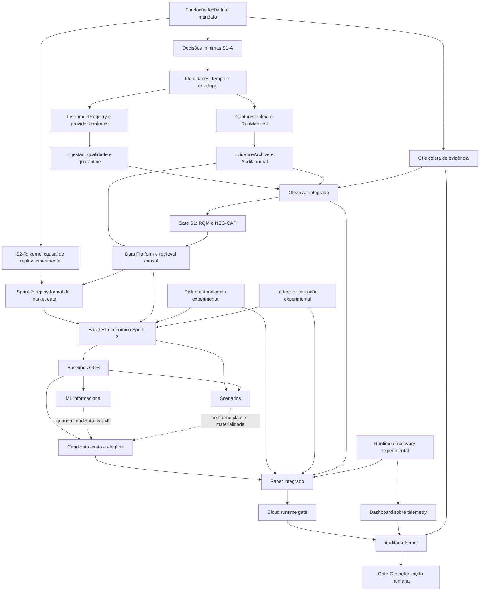

# Program Execution — BTG AI Trader

## Checkpoint remoto

MANDATE_STATUS = IN_PROGRESS
NO_READY_WORK = FALSE
RESUMPTION_CHECKPOINT = 7e547eaf0adb3bb68063e76a97ee6c2f25244bfd
REMOTE_DIVERGENCE_AT_RESUMPTION = NONE

Retomada de 2026-09-13: arquivo e branch consultados diretamente no GitHub confirmaram o checkpoint conhecido. A interrupção anterior não encerrou o mandato. A seção histórica de interrupção abaixo é preservada como registro da rodada anterior.

Data: 2026-09-13. Fonte de autorização: Master Autonomous Program Execution Mandate da coordenação humana recebido nesta execução. A autorização nova não é atribuída retroativamente ao PR #5.

```text
AUTHORITATIVE_STATE = GITHUB_REMOTE
REPOSITORY = paulobmcosta-creator/btg-ai-trader
LOCAL_USER_CHECKOUT = OUT_OF_SCOPE
FOUNDATION_0A_TO_0F = FORMALLY_CLOSED
LAST_CONFIRMED_REMOTE_STATE = dabce69d92054b77cad72809669d4340c211c328
SPRINT_BRANCH = sprint/1-market-observer
MAIN_AT_INITIAL_INSPECTION = 87634d529c32f4f7a564a318323aad2fcd8596d1
PR_5 = MERGED
PR_5_MERGE_COMMIT = dabce69d92054b77cad72809669d4340c211c328
ISSUE_1 = COMPLETED
PRE_CODE_RECONCILIATION = COMPLETE
SPRINT_1_LIFECYCLE = OPEN
S1_A_AUTHORIZED = YES
FIRST_FUNCTIONAL_CODE = AUTHORIZED
CANONICAL_PROMOTION = GATE_CONTROLLED
REAL_MONEY = NO
LIVE_TRADING = NO
TRADING_CREDENTIALS = NO
```

Verificação direta: [PR #5](https://github.com/paulobmcosta-creator/btg-ai-trader/pull/5) merged às 19:31:51Z; [Issue #1](https://github.com/paulobmcosta-creator/btg-ai-trader/issues/1) closed/completed às 19:32:15Z. A árvore recursiva de entrada contém 56 blobs, apenas bootstrap em src e um teste de versão, sem workflows. Isso não representa Observer implementado.

## Autoridade e evidências preservadas

Leitura distribuída integral de AGENTS, README, Master Plan, SPRINT_0/0E/1, 0F-B e companion, 0F-E, 0F-F, SAFETY, ADRs 0001–0022 e TRACEABILITY concluída no SHA de entrada antes das alterações. Protocolos quantitativos adicionais são lidos por workstream antes da respectiva implementação.

Snapshots preservados sem alteração:
- 0F-B: blob `819397f0a3fe322ef199d053b2ccbe9a6fdb5747`.
- 0F-E: blob `b04901dcc5612d3d418a6603a3a51a8e6e18ae08`.
- 0F-F: blob `7204d409edd1239853ab2282e9a7a4411a068bba`.
- [Issue #6](https://github.com/paulobmcosta-creator/btg-ai-trader/issues/6) continua aberta como errata histórica: FI-02 → QPI-05; FI-04 → QPI-09/QPI-11; FI-18 → QPI-13.
- [TRACEABILITY](../protocols/quantitative/TRACEABILITY.md) é a autoridade canônica QPI.

Drift identificado: documentos vivos ainda retinham autorização NO e gate pré-código pendente. Esta reconciliação registra o novo mandato e preserva os registros cronológicos anteriores. Nenhuma norma histórica foi silenciosamente substituída por implementação.

## DAG material



As arestas de desenvolvimento não substituem os marcos de promoção 1–12. S3 já precisa de Risk suficiente e cadeia econômica simulada; não pode adiar todo veto até o marco S7. S8 não exige cloud S9 para desenvolver seu núcleo. Risk/ledger/replay de sprints futuros não entram na baseline S1.

## Workstreams e classificação

READY indica trabalho executável, não aprovação. Cada branch e SHA confirmado está na tabela de persistência; PRs continuam separados e sem merge.

| ID | Sprint | Trabalho | Classe | Estado / dependência material |
|---|---|---|---|---|
| P-01 | transversal | Reconciliação viva e checkpoint | CANONICAL | IMPLEMENTED em PR #7; revisão independente encontrou duas arestas excessivas do DAG, corrigidas neste checkpoint |
| A-01 | 11 transversal | CI Python e evidência por commit | CANONICAL | IMPLEMENTED em PR #8; seis checks remotos PASS no SHA registrado |
| S1-A | 1 | Tipos imutáveis, IDs, temporalidade, envelope, tick/candle, instrumento | CANONICAL | IMPLEMENTED no PR #10; 6 checks PASS e re-review concluída; não equivale ao Sprint 1 completo |
| S1-B | 1 | Registry scoped point-in-time e capabilities provider | CANONICAL | IMPLEMENTED em PR #12 empilhado sobre #10; DD-33/58 registrados antes do código, 6 checks PASS |
| S1-C | 1 | Proveniência, manifestos, configuração | CANONICAL | PARTIALLY_IMPLEMENTED em PR #15 (modelos em memória); DD-01/40/41 registrados; sem config concreta ou serialização; revisão independente pendente |
| S1-D | 1 | Ingestão, filas finitas, dedupe, quarantine e liveness | CANONICAL | Health puro em PR #14; ingestão/filas/quarantine ainda não implementados; DD-22/54/57/59/62 conforme trigger |
| S1-E | 1 | EvidenceArchive e AuditJournal técnicos | CANONICAL | BLOCKED por envelope/contexto; DD-02/21/26; DD-20 só se banco |
| S1-F | 1 | Integração e matriz 41 RQMs/118 cláusulas/10 NEG-CAP | CANONICAL | BLOCKED por S1-A..E e CI; não declarar aprovação parcial integral |
| SP-01 | spike | Provider real / MT5 candidato | SPECULATIVE | PR #11: instalação/import remoto PASS; conexão/coleta não executadas; 11 condições não provadas; DD-60 permanece indefinido |
| S2-A | 2 | Dataset identities, lineage, storage/retrieval | SPECULATIVE | BLOCKED para integração por envelope/persistência; propostas reversíveis permitidas |
| S2-R | 2 | Clock controlado e scheduler causal de fixtures; precursor do replay formal | SPECULATIVE | IMPLEMENTED em PR #9 draft, seis checks PASS; não integrar S1 |
| S3-A | 3 | Custos, fills, liquidez e backtest econômico | SPECULATIVE | BLOCKED por dados causais, Risk e cadeia econômica simulada |
| S4-A | 4 | Baselines simples, nulos, OOS/walk-forward | SPECULATIVE | BLOCKED por replay mínimo e protocolo ex ante |
| S5-A | 5 | Features/registry/treino/validação | SPECULATIVE | Contratos reversíveis possíveis; integração BLOCKED por S2/S3/S4 |
| S6-A | 6 | Stress/scenario identity e perturbações | SPECULATIVE | Contratos reversíveis possíveis; integração BLOCKED por S2/S3 |
| S7-A | 7 | Veto, limites e autorização com snapshots fictícios | SPECULATIVE | READY para proposta; DDs do estágio antes de concretizar policies; sem promoção S1 |
| S8-A | 8 | Vertical offline Risk/Paper/portfolio/ledger | SPECULATIVE | BLOCKED por contratos Market/Signal/Risk e ledger/recovery |
| S9-A | 9 | Lifecycle/watchdog/health/recovery sem integração financeira | SPECULATIVE | READY para contratos e fixtures; integração depende dos componentes |
| S10-A | 10 | Telemetry view models e UI sobre mocks | SPECULATIVE | READY para contrato mock declarado; integração depende telemetry |
| S11-A | 11 | Auditoria formal | BLOCKED | Evidência verificável do sistema ainda inexistente |
| S12-A | 12 | Arquitetura/runbooks/dry-run/capability gates | SPECULATIVE | READY para documentação; sem provisão ou compromisso financeiro |
| S12-G | 12 | Promoção/ativação financeira real | HUMAN_ONLY | Novo mandato humano após Gate G |
| LIVE | transversal | Ordens broker, credenciais trading, real money, bypass Risk | FORBIDDEN_OPERATIONAL | Não executar neste mandato |

`MUST_REMAIN_UNDECIDED_NOW` não vira escolha canônica por existir uma branch. Propostas futuras devem manter estado experimental e explicitar suas DDs. Forks arquiteturais não catalogados exigem classificação antes de código dependente.

## Decisões operacionais desta execução

- GitHub Git Data/Contents API para edição; nada depende do checkout do usuário.
- Reconciliação documental antecede commits funcionais.
- S1 começa com stdlib, modelos puros e testes; provider real DD-60 não bloqueia modelos e fakes.
- Representações físicas mínimas serão registradas em documento de decisões antes do código. ADR se material; nenhum status humano APPROVED será inventado.
- Integração sintética/histórica é harness de engenharia offline, não evidência Paper prospectiva. Paper formal exige mercado contemporâneo, candidato exato versionado, protocolo ex ante e Risk suficiente.
- QPI-13/14/15: desenvolvimento, avaliação, promoção e autoridade são estados distintos.

## Persistência remota

| Workstream | Branch remota | Commit / PR | Estado |
|---|---|---|---|
| Entrada | sprint/1-market-observer | dabce69d92054b77cad72809669d4340c211c328 / #5 merged | Confirmado |
| Fundação global | main | 87634d529c32f4f7a564a318323aad2fcd8596d1 | Confirmado; sem promoção automática |
| P-01 | s1/00-post-merge-authorization | 183203307169f41ce40e035fe19f1d0a570e3e16 / [#7](https://github.com/paulobmcosta-creator/btg-ai-trader/pull/7) | Persistido; checkpoint evolui nesta branch |
| A-01 | s11/01-remote-ci | 3bbdcefee96a9d3662112cac97feeb86d7cc7093 / [#8](https://github.com/paulobmcosta-creator/btg-ai-trader/pull/8) | Aberto; 6 checks PASS |
| S1-A | s1/01-observation-domain | 5158dc3375fd9ed0a311dd745a981fadf2ea643a / [#10](https://github.com/paulobmcosta-creator/btg-ai-trader/pull/10) | Draft; 6 checks PASS; dois findings temporais corrigidos e re-revistos |
| S2-R | s3/01-causal-replay-kernel (nome histórico preservado) | ad969b48e0cfbc5e942755cbbebeab89e5085aa4 / [#9](https://github.com/paulobmcosta-creator/btg-ai-trader/pull/9) | Draft; SPECULATIVE; 6 checks PASS |
| S1-B | s1/02-registry-provider-contracts | a594a85cc41efab773e5d56d68560f3d281eda19 / [#12](https://github.com/paulobmcosta-creator/btg-ai-trader/pull/12) | Draft; 6 checks PASS; base #10 |
| A-02 | s11/02-foundation-integrity | 99714c4df1abbb58daca9f9c19c5eb4737e2c316 / [#13](https://github.com/paulobmcosta-creator/btg-ai-trader/pull/13) | Draft; 7 checks PASS; base #8 |
| SP-01 | spike/mt5-import-surface | 8c81980205a9b934af39614b67083a03b6695f6b / [#11](https://github.com/paulobmcosta-creator/btg-ai-trader/pull/11) | Draft; import Windows PASS |
| S1-C | s1/03-capture-provenance | 146bec8a5a63255cd710c78ad6f663710d5cf72e / [#15](https://github.com/paulobmcosta-creator/btg-ai-trader/pull/15) | Draft; 6 checks PASS; revisão independente pendente |
| S1-health | s1/04-observer-health | 40a9b5788504dd8620fab74f6c04d4618422217e / [#14](https://github.com/paulobmcosta-creator/btg-ai-trader/pull/14) | Draft; 6 checks PASS; revisão independente pendente |
| Staging experimental | integration/research | 183203307169f41ce40e035fe19f1d0a570e3e16 | Base do PR #9; nenhum merge |
| Staging de spike | integration/provider-spikes | 183203307169f41ce40e035fe19f1d0a570e3e16 | Base do PR #11; nenhum merge |

## Verificações, findings e gates

- Inspeção remota de refs, árvore, PR #5, Issue #1/#6 e bootstrap: executada.
- Revisão documental: fonte da nova autorização explícita, snapshots excluídos da alteração, registros cronológicos históricos preservados.
- Verificação textual em memória: substituições exatas e ausência de whitespace final nos documentos alterados; não equivale a `git diff --check`.
- CI existente na baseline: nenhum workflow, run ou check-run encontrado.
- `pytest`, coverage, Ruff, mypy, compileall, pip check, git diff --check, scans security/static, NEG-CAP/config/secrets: `NOT_EXECUTED` nesta reconciliação.
- REASON: sem runner remoto configurado ainda; execução no computador físico do usuário excluída.
- RISK: ausência de evidência de execução; nenhum gate de implementação ou promoção satisfeito por isso.
- REQUIRED_FOLLOWUP: publicar CI remota, executar contra SHA exato e associar evidência. Primeiro PR funcional exige Codex Security Security Diff Scan conforme Issue #1; esse scan não é substituído por lint ou testes negativos.
- Gates satisfeitos por evidência/autorização: Fundação encerrada; PR #5 integrado; Issue #1 concluída; S1-A autorizado.
- Gates ainda não satisfeitos: implementação/aceitação S1, promoção S2–S12, aprovação financeira.

## Evidência remota coletada após o checkpoint inicial

- CI bootstrap no PR #8, SHA `3bbdcefee96a9d3662112cac97feeb86d7cc7093`: [run 34779510876](https://github.com/paulobmcosta-creator/btg-ai-trader/actions/runs/34779510876) SUCCESS, seis jobs (tests, lint, types, compile, dependencies, diff). Python 3.12.14; 1 teste bootstrap, 100% de apenas 2 statements. Não comprova Observer funcional.
- S2-R fixture kernel (classificação S3 anterior corrigida), SHA `ad969b48e0cfbc5e942755cbbebeab89e5085aa4`: [run 34779661666](https://github.com/paulobmcosta-creator/btg-ai-trader/actions/runs/34779661666) SUCCESS, seis checks, 24 testes totais; kernel 85 statements/30 branches com 100% de cobertura. Primeira falha de lint nos testes corrigida; não é evidência de Backtester econômico ou Paper.
- S1-A final, SHA `5158dc3375fd9ed0a311dd745a981fadf2ea643a`: [run 34780036474](https://github.com/paulobmcosta-creator/btg-ai-trader/actions/runs/34780036474) SUCCESS, seis checks, 45 testes, cobertura agregada 94%. Dois findings P2 corrigidos: knowledge_time interno anterior à ingestão e candle final disponível cedo. Adendo de decisão `75ae4f35bbf112fe94292e3ac85df5813ea9a64b` precedeu o código corretivo. Re-review independente confirmou resolução; nenhuma claim de S1 integral.
- S1-B, SHA `a594a85cc41efab773e5d56d68560f3d281eda19`: [run 34780412293](https://github.com/paulobmcosta-creator/btg-ai-trader/actions/runs/34780412293) SUCCESS, seis checks, 70 testes totais incluindo S1-A. Módulos novos registry/provider com 100% de cobertura; agregado 96%. DD-33/58 em `bf5d07cf` antes do código; nenhum provider concreto.
- Foundation guard, SHA `99714c4df1abbb58daca9f9c19c5eb4737e2c316`: [run 34780763204](https://github.com/paulobmcosta-creator/btg-ai-trader/actions/runs/34780763204) SUCCESS, sete jobs. Implementação `d1eebe9d` testou sete testes (seis de integridade + bootstrap) e validou bytes/counters; atualização final só documenta evidência. Revisão independente sem blocker; verificação de documentos não comprova NEG-CAP runtime.
- Spike MT5, SHA `8c81980205a9b934af39614b67083a03b6695f6b`: [run 34780543045](https://github.com/paulobmcosta-creator/btg-ai-trader/actions/runs/34780543045) SUCCESS. Windows 2022, Python 3.12.10, MT5 5.0.6180 e NumPy 1.26.4 instalados em venv descartável via wheels/hash fixados. O probe importou pacotes e constatou símbolos sem invocar função SDK. A instalação/importação não prova isolamento do SDK, conexão, timestamps, heartbeat ou reconnect. Nenhuma mudança em dependências de runtime da aplicação.
- Resultados de branches diferentes não são uma suíte integrada: os 70 testes S1-B incluem os 45 S1-A; não somar contadores como cobertura única do sistema.
- Blobs de 0F-B/E/F e companion comparados novamente após PR #7: idênticos à entrada.
- Revisão independente documental corrigiu dependência artificial do kernel causal nos modelos S1 e dependência universal indevida de Paper em ML/Scenario. ML é opcional; robustez/scenarios dependem da claim. Nenhum outro gate foi concedido por essa correção.

## Workstreams preservados durante o encerramento

- PR #14: health puro, branch `s1/04-observer-health`, SHA `40a9b5788504dd8620fab74f6c04d4618422217e`; [run 34780944239](https://github.com/paulobmcosta-creator/btg-ai-trader/actions/runs/34780944239) SUCCESS, seis checks, 83 testes incluindo S1-A; health.py 99% de cobertura, agregado 96%. Decisões DD-36/37 em commits anteriores. Não integra coleta real, fila ou persistência. Revisão independente do código novo ainda pendente; CI não substitui essa revisão.
- PR #15: modelos de captura/proveniência e lineage em memória, SHA `146bec8a5a63255cd710c78ad6f663710d5cf72e`; [run 34780999514](https://github.com/paulobmcosta-creator/btg-ai-trader/actions/runs/34780999514) SUCCESS, seis checks, 69 testes (inclui S1-A), cobertura agregada 90%; provenance.py 82%, lineage.py 94%. Decisões DD-01/40/41 em `94df106a2ce4d67b86427cb344f3cc8161a6644a` antes do código. Configuração concreta/serialização/persistência não implementadas. Revisão independente ainda pendente; cobertura incompleta deve ser examinada antes de promover.
- S1-B (#12), S1-C (#15) e health (#14) são branches irmãs sobre S1-A (#10), não uma composição integrada. Não somar contadores de teste. Todas permanecem draft.

## Bloqueio de ferramenta para Security Diff Scan

```text
SECURITY_DIFF_SCAN = NOT_EXECUTED
SCAN_ID = NOT_CREATED
REASON = REMOTE_TOOLING_UNAVAILABLE
RISK = RECORDED
FOLLOWUP = REQUIRED_BEFORE_GATE_WHERE_MANDATORY
TECHNICAL_DETAIL = DESKTOP_SCAN_REQUIRES_LOCAL_GIT_TARGET
RISK_DETAIL = REQUIRED_FUNCTIONAL_SECURITY_REVIEW_EVIDENCE_MISSING
REQUIRED_FOLLOWUP = RUN_OFFICIAL_SCAN_ON_EXACT_REMOTE_BASE_AND_HEAD_IN_AUTHORIZED_CLOUD_OR_REMOTE_CODEX_ENVIRONMENT
```

Inspeção da interface `start_codex_security_prompt_only_scan` confirmou `targetPath` local obrigatório e `diffTarget` de revisões Git locais. A skill security-diff-scan exige usar scanId/contexto autoritativo antes de análise substantiva; a alternativa terminal também exige checkout e scripts locais. Esta sessão desktop não oferece alvo cloud para esse plugin. Nenhum checkout do usuário será usado para contornar o mandato remoto; nenhum scan não oficial será rotulado Codex Security. Revisões comuns de código não substituem o scan exigido pela Issue #1.

O status consultivo TAC foi `not_granted`; não foi usado como autorização nem como causa deste bloqueio técnico. Os gates de promoção funcional permanecem fechados enquanto esse requisito faltar. Não houve merge em main, sprint ou staging.

## Continuação

CURRENT_BLOCKERS: Security Diff Scan oficial sem alvo remoto compatível nesta sessão; suíte NEG-CAP integral ainda não implementada; provider real condicionado a DD-60/11 condições e ambiente isolado; ativação financeira HUMAN_ONLY/FORBIDDEN neste mandato. CI Python está disponível.

NEXT_READY_ACTIONS:
1. Revisar independentemente PRs #14/#15 (health/provenance), completar casos ausentes e revalidar HEADs; S1-A já teve seus dois findings temporais corrigidos/re-revistos.
2. Integrar apenas quando gates permitirem; desenvolver contrato/provider fake, ingestão, quarantine e persistência com decisões registradas antes do código. Registry/provenance/health ainda estão em branches distintas.
3. Provider real permanece DD-60 indefinido; instalação/import MT5 concluídas no spike isolado não autorizam conexão nem provam as 11 condições.
4. Executar Security Diff Scan oficial em superfície permitida quando disponível; manter promoção bloqueada sem evidência.
5. Manter branches futuras isoladas, revisar cada diff e atualizar este checkpoint antes de qualquer interrupção.

## Interrupção desta rodada — limite real de sessão

STOP_REASON = TOOL_OR_SESSION_LIMIT. Em 2026-09-13, um worker retornou explicitamente “You've hit your usage limit”; nenhuma tentativa de contornar limite ou aumentar consumo foi feita. Encerramento restringe-se a preservar branches, PRs, resultados e pendências. O mandato inteiro não está concluído e ainda existem nós READY; não registrar NO_READY_WORK.

Matriz consolidada RQM_EXECUTION_STATUS foi planejada, mas o worker atingiu o limite antes de produzi-la: NOT_CREATED. As 41 obrigações continuam no contrato canônico; documentos de decisões dos PRs declaram cobertura parcial. A tabela geral não substitui essa matriz nem os testes NEG-CAP.

LAST_CONFIRMED_REMOTE_STATE: baseline sprint/1-market-observer = dabce69d92054b77cad72809669d4340c211c328; main = 87634d529c32f4f7a564a318323aad2fcd8596d1. Novos commits residem somente nas branches/PRs identificados acima. O commit que contém este checkpoint é obtido no histórico Git do próprio arquivo; seu hash não é autorreferenciado.

CURRENT_PRS: #7–#15 abertos, sem merge; #9 e #11 têm bases próprias de integração experimental; #14/#15 foram persistidos com CI verde durante o encerramento. Nenhum trading, segredo, conexão a conta, deploy ou compromisso econômico realizado. O checkout físico do usuário não foi usado como superfície de desenvolvimento ou evidência.

NEXT_READY_ACTIONS após reposição de capacidade de sessão: carregar este checkpoint, revalidar refs remotos, concluir workstreams parciais, revisar e testar seus HEADs, compor fake provider/ingestão/quarantine/evidência somente após decisões materiais registradas, e obter Security Diff Scan oficial em ambiente permitido. Qualquer arquitetura material nova (incluindo escolha de transporte DD-22 quando ativada) exige o ADR aplicável antes do código dependente.

## Retomada — higiene Wave 1 em andamento

- PR #7: thread `PRRT_kwDOUDTxZM6h7mU8` encontrado `is_outdated=true`, `is_resolved=false`. O finding P2 não estava corrigido: a tabela ainda atribuía replay ao Sprint 3. Esta alteração move o workstream para S2-R, explicita replay formal no marco Sprint 2 e reserva S3-A ao backtester econômico conforme 0F-E seção 18. O precursor não satisfaz o entregável formal de S2.
- PR #9 será apresentado como S2-R; o nome histórico `s3/01-causal-replay-kernel` será preservado para não destruir commits ou recriar o PR. Sua base continua `integration/research`; nunca S1. A resolução do thread ocorrerá apenas após readback das duas correções.
- Revalidação de PRs #7/#8/#10/#12/#13/#14/#15 confirmou todos abertos e sem merge. Threads #8/#10/#12/#13/#14/#15: zero no instante consultado. Revisões independentes atuais de #14/#15 e da stack #8/#13 foram distribuídas; evidências serão anexadas aos respectivos HEADs.
- Prioridade: corrigir/revisar Wave 1, avaliar gates sem converter CI em aprovação, continuar S1-D/E/F e propostas futuras READY. Nenhum gate funcional promovido.
