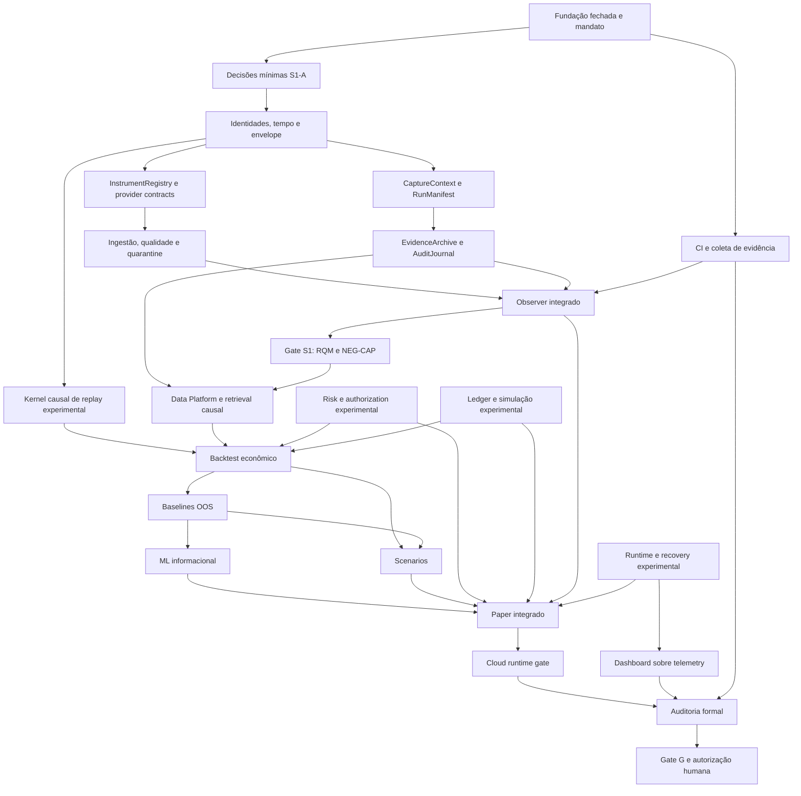

# Program Execution — BTG AI Trader

## Checkpoint remoto

Data: 2026-09-13. Fonte de autorização: Master Autonomous Program Execution Mandate da coordenação humana recebido nesta execução. A autorização nova não é atribuída retroativamente ao PR #5.

```text
AUTHORITATIVE_STATE = GITHUB_REMOTE
REPOSITORY = paulobmcosta-creator/btg-ai-trader
LOCAL_USER_CHECKOUT = OUT_OF_SCOPE
FOUNDATION_0A_TO_0F = FORMALLY_CLOSED
LAST_CONFIRMED_REMOTE_STATE = dabce69d92054b77cad72809669d4340c211c328
SPRINT_BRANCH = sprint/1-market-observer
MAIN_AT_INITIAL_INSPECTION = 87634d529c32f4f7a564a318323aad2fcd8596d1
PR_5 = MERGED
PR_5_MERGE_COMMIT = dabce69d92054b77cad72809669d4340c211c328
ISSUE_1 = COMPLETED
PRE_CODE_RECONCILIATION = COMPLETE
SPRINT_1_LIFECYCLE = OPEN
S1_A_AUTHORIZED = YES
FIRST_FUNCTIONAL_CODE = AUTHORIZED
CANONICAL_PROMOTION = GATE_CONTROLLED
REAL_MONEY = NO
LIVE_TRADING = NO
TRADING_CREDENTIALS = NO
```

Verificação direta: [PR #5](https://github.com/paulobmcosta-creator/btg-ai-trader/pull/5) merged às 19:31:51Z; [Issue #1](https://github.com/paulobmcosta-creator/btg-ai-trader/issues/1) closed/completed às 19:32:15Z. A árvore recursiva de entrada contém 56 blobs, apenas bootstrap em src e um teste de versão, sem workflows. Isso não representa Observer implementado.

## Autoridade e evidências preservadas

Leitura distribuída integral de AGENTS, README, Master Plan, SPRINT_0/0E/1, 0F-B e companion, 0F-E, 0F-F, SAFETY, ADRs 0001–0022 e TRACEABILITY concluída no SHA de entrada antes das alterações. Protocolos quantitativos adicionais são lidos por workstream antes da respectiva implementação.

Snapshots preservados sem alteração:
- 0F-B: blob `819397f0a3fe322ef199d053b2ccbe9a6fdb5747`.
- 0F-E: blob `b04901dcc5612d3d418a6603a3a51a8e6e18ae08`.
- 0F-F: blob `7204d409edd1239853ab2282e9a7a4411a068bba`.
- [Issue #6](https://github.com/paulobmcosta-creator/btg-ai-trader/issues/6) continua aberta como errata histórica: FI-02 → QPI-05; FI-04 → QPI-09/QPI-11; FI-18 → QPI-13.
- [TRACEABILITY](../protocols/quantitative/TRACEABILITY.md) é a autoridade canônica QPI.

Drift identificado: documentos vivos ainda retinham autorização NO e gate pré-código pendente. Esta reconciliação registra o novo mandato e preserva os registros cronológicos anteriores. Nenhuma norma histórica foi silenciosamente substituída por implementação.

## DAG material



As arestas de desenvolvimento não substituem os marcos de promoção 1–12. S3 já precisa de Risk suficiente e cadeia econômica simulada; não pode adiar todo veto até o marco S7. S8 não exige cloud S9 para desenvolver seu núcleo. Risk/ledger/replay de sprints futuros não entram na baseline S1.

## Workstreams e classificação

READY indica trabalho executável, não aprovação. Branches abaixo são propostas até terem SHA/PR confirmados na tabela de persistência.

| ID | Sprint | Trabalho | Classe | Estado / dependência material |
|---|---|---|---|---|
| P-01 | transversal | Reconciliação viva e checkpoint | CANONICAL | READY; novo mandato e fatos remotos confirmados |
| A-01 | 11 transversal | CI Python e evidência por commit | CANONICAL | READY; depende da permissão efetiva de gravar workflow |
| S1-A | 1 | Tipos imutáveis, IDs, temporalidade, envelope, tick/candle, instrumento | CANONICAL | READY após DD-01/03/04/67 registrados |
| S1-B | 1 | Registry scoped point-in-time e capabilities provider | CANONICAL | BLOCKED por interfaces S1-A; DD-33/58 antes da implementação |
| S1-C | 1 | Proveniência, manifestos, configuração | CANONICAL | BLOCKED por identidades; DD-40/41/65 antes da implementação |
| S1-D | 1 | Ingestão, filas finitas, dedupe, quarantine e liveness | CANONICAL | BLOCKED por S1-B/C; DD-36/37/54/57/59/62 conforme trigger |
| S1-E | 1 | EvidenceArchive e AuditJournal técnicos | CANONICAL | BLOCKED por envelope/contexto; DD-02/21/26; DD-20 só se banco |
| S1-F | 1 | Integração e matriz 41 RQMs/118 cláusulas/10 NEG-CAP | CANONICAL | BLOCKED por S1-A..E e CI; não declarar aprovação parcial integral |
| SP-01 | spike | Provider real / MT5 candidato | SPECULATIVE | READY para pesquisa isolada; conexão depende ambiente compatível, DD-60 e credenciais read-only se exigidas |
| S2-A | 2 | Dataset identities, lineage, storage/retrieval | SPECULATIVE | BLOCKED para integração por envelope/persistência; propostas reversíveis permitidas |
| S3-A | 3 | Clock controlado e scheduler causal de fixtures | SPECULATIVE | READY isoladamente; sem motor no S1, sem claims financeiras |
| S3-B | 3 | Custos, fills, liquidez e backtest econômico | SPECULATIVE | BLOCKED por dados causais, Risk e cadeia econômica simulada |
| S4-A | 4 | Baselines simples, nulos, OOS/walk-forward | SPECULATIVE | BLOCKED por replay mínimo e protocolo ex ante |
| S5-A | 5 | Features/registry/treino/validação | SPECULATIVE | Contratos reversíveis possíveis; integração BLOCKED por S2/S3/S4 |
| S6-A | 6 | Stress/scenario identity e perturbações | SPECULATIVE | Contratos reversíveis possíveis; integração BLOCKED por S2/S3 |
| S7-A | 7 | Veto, limites e autorização com snapshots fictícios | SPECULATIVE | READY para proposta; DDs do estágio antes de concretizar policies; sem promoção S1 |
| S8-A | 8 | Vertical offline Risk/Paper/portfolio/ledger | SPECULATIVE | BLOCKED por contratos Market/Signal/Risk e ledger/recovery |
| S9-A | 9 | Lifecycle/watchdog/health/recovery sem integração financeira | SPECULATIVE | READY para contratos e fixtures; integração depende dos componentes |
| S10-A | 10 | Telemetry view models e UI sobre mocks | SPECULATIVE | READY para contrato mock declarado; integração depende telemetry |
| S11-A | 11 | Auditoria formal | BLOCKED | Evidência verificável do sistema ainda inexistente |
| S12-A | 12 | Arquitetura/runbooks/dry-run/capability gates | SPECULATIVE | READY para documentação; sem provisão ou compromisso financeiro |
| S12-G | 12 | Promoção/ativação financeira real | HUMAN_ONLY | Novo mandato humano após Gate G |
| LIVE | transversal | Ordens broker, credenciais trading, real money, bypass Risk | FORBIDDEN_OPERATIONAL | Não executar neste mandato |

`MUST_REMAIN_UNDECIDED_NOW` não vira escolha canônica por existir uma branch. Propostas futuras devem manter estado experimental e explicitar suas DDs. Forks arquiteturais não catalogados exigem classificação antes de código dependente.

## Decisões operacionais desta execução

- GitHub Git Data/Contents API para edição; nada depende do checkout do usuário.
- Reconciliação documental antecede commits funcionais.
- S1 começa com stdlib, modelos puros e testes; provider real DD-60 não bloqueia modelos e fakes.
- Representações físicas mínimas serão registradas em documento de decisões antes do código. ADR se material; nenhum status humano APPROVED será inventado.
- Integração sintética/histórica é harness de engenharia offline, não evidência Paper prospectiva. Paper formal exige mercado contemporâneo, candidato exato versionado, protocolo ex ante e Risk suficiente.
- QPI-13/14/15: desenvolvimento, avaliação, promoção e autoridade são estados distintos.

## Persistência remota

| Workstream | Branch remota | Commit / PR | Estado |
|---|---|---|---|
| Entrada | sprint/1-market-observer | dabce69d92054b77cad72809669d4340c211c328 / #5 merged | Confirmado |
| Fundação global | main | 87634d529c32f4f7a564a318323aad2fcd8596d1 | Confirmado; sem promoção automática |
| P-01 | s1/00-post-merge-authorization | A registrar após commit e criação do PR | Preparado |
| A-01 | s11/01-remote-ci | Não criado | Próximo READY |
| S1-A | s1/01-observation-domain | Não criado | Próximo READY |
| S3-A | s3/01-causal-replay-kernel | Não criado | Próximo SPECULATIVE |

## Verificações, findings e gates

- Inspeção remota de refs, árvore, PR #5, Issue #1/#6 e bootstrap: executada.
- Revisão documental: fonte da nova autorização explícita, snapshots excluídos da alteração, registros cronológicos históricos preservados.
- Verificação textual em memória: substituições exatas e ausência de whitespace final nos documentos alterados; não equivale a `git diff --check`.
- CI existente na baseline: nenhum workflow, run ou check-run encontrado.
- `pytest`, coverage, Ruff, mypy, compileall, pip check, git diff --check, scans security/static, NEG-CAP/config/secrets: `NOT_EXECUTED` nesta reconciliação.
- REASON: sem runner remoto configurado ainda; execução no computador físico do usuário excluída.
- RISK: ausência de evidência de execução; nenhum gate de implementação ou promoção satisfeito por isso.
- REQUIRED_FOLLOWUP: publicar CI remota, executar contra SHA exato e associar evidência. Primeiro PR funcional exige Codex Security Security Diff Scan conforme Issue #1; esse scan não é substituído por lint ou testes negativos.
- Gates satisfeitos por evidência/autorização: Fundação encerrada; PR #5 integrado; Issue #1 concluída; S1-A autorizado.
- Gates ainda não satisfeitos: implementação/aceitação S1, promoção S2–S12, aprovação financeira.

## Continuação

CURRENT_BLOCKERS: nenhum blocker para desenvolvimento de modelos puros; ausência de CI bloqueia promoção; provider real condicionado; ativação financeira HUMAN_ONLY/FORBIDDEN neste mandato.

NEXT_READY_ACTIONS:
1. Persistir reconciliação e abrir PR para sprint/1-market-observer.
2. Em paralelo, criar CI remota e registrar decisões mínimas/modelos S1-A em branches próprias.
3. Desenvolver kernel causal experimental isolado e propostas independentes de Risk/runtime.
4. Executar checks e revisão contra HEAD remoto; manter PRs pendentes se evidência faltar.
5. Atualizar este checkpoint com SHAs, PRs, resultados e blockers antes de qualquer interrupção.
