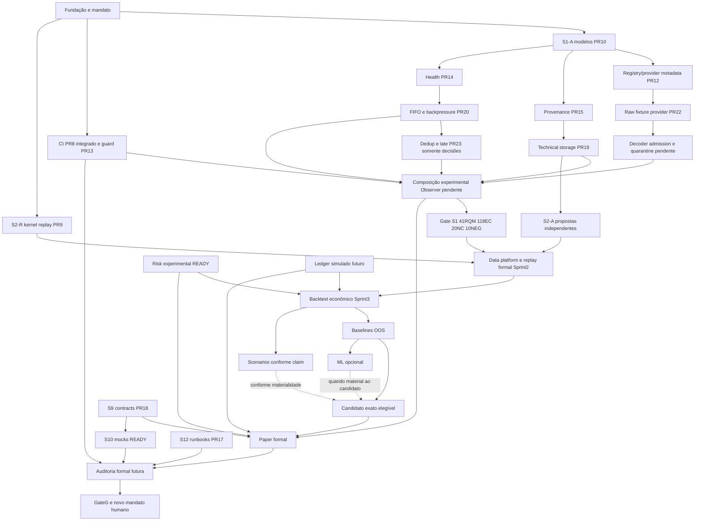

# Program Execution — BTG AI Trader

## Checkpoint de consolidação S1 — 2026-09-13 22:40 UTC

Este adendo substitui os estados correntes do histórico abaixo. Retomada conferida diretamente em a9f2ee8f6b0d551f5da5b5ea2c9263966dcc5679, sem drift; trabalho exclusivamente GitHub remoto.

MANDATE_STATUS=IN_PROGRESS; STOP_REASON=NONE; NO_READY_WORK=FALSE; CONSOLIDATE_S1=PRIORITY.
SPRINT1_ACCEPTANCE=NOT_GRANTED; SECURITY_DIFF_SCAN=NOT_EXECUTED; REMOTE_TOOLING_UNAVAILABLE; RISK_RECORDED.
Main permanece87634d529c32f4f7a564a318323aad2fcd8596d1; nenhum trading/credencial/conexão/deploy.

PR13 integrado após review independente5192530694 no HEAD3f57d3ce758dcd832b2018001530c162ba007253, zero threads e delta9blobs/pins revalidados. Merge d22e73f10d1e0ca21cbd7a0af90b94719debad44, pais3bee60a3d989ac8f1fb6d21ecb1c32fab13cf2de e3f57d3ce758dcd832b2018001530c162ba007253. Tree0705c15ff16a556cc9a29be4da836a4c1f8e0456. Baseline pushCI34787158732 SUCCESS. Integração apenas engenharia.

Pilha reancorada via commits de merge GitData, preservando blobs dos deltas próprios. PR10 usa CI Foundation atual em vez do workflow antigo duplicado; demais deltas byte-idênticos. Merge-base de cada comparação é o novo upstream exato. Nenhum PR funcional foi promovido.

|PR|HEAD atualizado|CI remoto PR / upstream verification|
|---|---|---|
|#10|d3c7b61ae8b6691e60d3d981be518f233d733e62|34787198823, 34787198563, 34787198769, 34787197066 SUCCESS|
|#12|5d1898e388be5b4e7394172bcc409e1383b57e4a|34787203787, 34787203786, 34787201646 SUCCESS|
|#14|5e8bb83f7bffb9a0ccc1147522982787ebd8027f|34787206400, 34787206403, 34787204291 SUCCESS|
|#15|063f30b53d616af4990244cc66069b152ed94e2d|34787209530, 34787209423, 34787206513 SUCCESS|
|#19|1eddcfa4f198cd0b3324a6c4713761510844afec|34787212585, 34787212415, 34787209471 SUCCESS|
|#20|19200e7e6443227f68521250bc569943be7c5eeb|34787214385, 34787214358, 34787211576 SUCCESS|
|#22|4a252efabde0dc8aed2fcccc6e62ca2df1860f59|34787216294, 34787216282, 34787214178 SUCCESS|

PR23 implementado em3c3c9f893de8730d2cfa60e1784004583b378508, CI34787109317 144tests/6SUCCESS, dedup100%, total98%; review independente5192535711 sem blocker. Reancoragem sobre novo20 em andamento.
PR24 decoder/admission/quarantine criado: raw preservado, schema fixture-json-v1 estrito, limites payload/JSON e erros estruturados, sem coerção otimista. Docs1d483088 antes código95bff033. PushCI34787377442 SUCCESS161tests; reancoragem sobre novo22 necessária para CI ampliada Foundation, em andamento.
PR25 plano NEG01..10 emf8af3febee9b649cbca7d3ef21086fa63eb89908; testes integrados ainda NÃO implementados, contrato de composição pendente.
Composição Observer, suite integrada exata e atualização matrizRQM16 são os próximos trabalhos. Não somar testes de branches.
S3–12 preservados, sem nova abertura especulativa; MT5 continua import-only/DD60 indeciso.


### Assembly isolado e evidência adicional — 22:56 UTC

Assembly S1-only `s1/11-observer-composition` criado em37ff91bc9a86269cd68ddf5537b474f49b7d0510 (tree1f6584c7af6131f328ab89651f511b3b01922ceb), pais23@09d8b1c40a8ae8ce7b78869e40c4f11f3ab82a26,24@dbe89d295f13412efb692e272e8e7934ade8f843,19@1eddcfa4f198cd0b3324a6c4713761510844afec. Comparebase=d22e73f1, somente36pathsS1. Identity usa supersetprovenance, restantesblobs iguais aos módulos revistos. CI34787518943 setechecksSUCCESS,341tests,95%branchcoverage. Esta execução é conjunta de módulos; composição runtime ainda sendo implementada em cima de ADR0025@ab5137e82d86b422045e47b56130e0c81a379ec8. Não houve promoção na sprint/main.

PR23 reancorada09d8b1c4: merge-base novo20,3blobs preservados; CI34787447734 setechecks/159testsSUCCESS. PR24 reancoradadbe89d29: merge-base novo22,3blobs preservados; CI34787472671 setechecks/176testsSUCCESS +upstream34787472673; review independente5192553029 sem blocker.

PR26 `s1/12-observer-properties`@dc145111be639d4858d821fdb1840e2544bc0e60: somente3arquivos testes/docs; CI34787908794 setechecksSUCCESS,378tests,95%; campanha real baseline36casosgerados (6seeds×6grupos),10mutantes/10detectados/0sobreviventes/0errors no catálogo, sourcehashintacto. Review independente5192572508 sem blocker. Integrar delta e repetir na composição final.

PR25 AST/config/secrets subset@53563fe3a1f3408a229d534a8eea0a74623e185d contém findingP2 review5192570702: escape de alias de módulo e de resultado refletido não detectado fora dospins. Correção+regressões em andamento. NEG01..10 runtime ainda NÃO_EXECUTADO; CI subset tem falhas em análise. Não aceitar como prova negativa completa. Duas frentes restantes ativas: composição e NEG; nenhum novo S3–12.

As revisões de ancestry10/12/14/15/19/20/22 foram publicadas5192554218/5192554251/5192554285/5192554313/5192554350/5192554377/5192554410, sem threads abertas ou alteração material própria.

## Histórico anterior (estados superados pelo adendo acima)

# Program Execution — BTG AI Trader

## Checkpoint autoritativo corrente — 2026-09-13

Este documento na branch `s1/00-post-merge-authorization` é a fonte operacional para retomada. O estado abaixo foi conferido diretamente no GitHub. Substitui os estados correntes dos checkpoints anteriores, preservados integralmente no histórico Git (entrada desta rodada `7e547eaf0adb3bb68063e76a97ee6c2f25244bfd`; checkpoint intermediário `0672b8a1545e73949439a1bfbf6df36cce2e9898`).

```text
MANDATE_STATUS = IN_PROGRESS
NO_READY_WORK = FALSE
STOP_REASON = TOOL_OR_SESSION_LIMIT
AUTHORITATIVE_STATE = GITHUB_REMOTE
REPOSITORY = paulobmcosta-creator/btg-ai-trader
LOCAL_USER_CHECKOUT = OUT_OF_SCOPE
FOUNDATION_0A_TO_0F = FORMALLY_CLOSED
PRE_CODE_RECONCILIATION = COMPLETE
S1_A_AUTHORIZED = YES
FIRST_FUNCTIONAL_CODE = AUTHORIZED
CANONICAL_PROMOTION = GATE_CONTROLLED
SPRINT1_ACCEPTANCE = NOT_GRANTED
MAIN = 87634d529c32f4f7a564a318323aad2fcd8596d1
SPRINT_BRANCH = sprint/1-market-observer
LAST_CONFIRMED_REMOTE_STATE = 3bee60a3d989ac8f1fb6d21ecb1c32fab13cf2de
REAL_MONEY = NO
LIVE_TRADING = NO
TRADING_CREDENTIALS = NO
BROKER_ORDER_SUBMISSION = NO
BROKER_ORDER_MODIFICATION = NO
BROKER_ORDER_CANCELLATION = NO
MODEL_DIRECT_TO_BROKER = NO
RISK_BYPASS = NO
```

A retomada começou consultando este arquivo e refs remotos: o SHA conhecido `7e547eaf...` correspondia exatamente à branch, sem divergência. Não houve reconstrução a partir de memória nem uso do checkout físico do usuário.

A parada atual é um novo limite real: os três agentes retornaram explicitamente “You've hit your usage limit” antes de concluir os próximos lotes. Não houve tentativa de contornar o limite. A coordenação encerrou apenas a preservação remota de código, decisões, PRs, reviews e evidências já produzidos. Ainda existe trabalho READY.

## Integrações verificadas

| PR | HEAD auditado | Merge remoto | Gate e evidência |
|---|---|---|---|
| #5 | Fundação histórica | dabce69d92054b77cad72809669d4340c211c328 | Fundação formalmente encerrada; Issue #1 completed. Autorização S1 deriva do mandato posterior, não retroativamente deste merge |
| [#7](https://github.com/paulobmcosta-creator/btg-ai-trader/pull/7) | dae6ff6e88ebb8c66e06f965224f9ee77f67a74f | df34c2cd0ce142a9805a993bdbdbc30ecbccbf04 | Apenas10 Markdown; review independente5192455959; finding replay resolvido; verificação remota exata34785315591/job103799607911 |
| [#8](https://github.com/paulobmcosta-creator/btg-ai-trader/pull/8) | c11bd71d1be76f76c986e2639812b127b6ca555a | 3bee60a3d989ac8f1fb6d21ecb1c32fab13cf2de | Workflow+documento;6checks PASS34785604692; reviews5192402872/5192474646; zero threads abertos na revalidação |

Os pais de #7 foram confirmados como `dabce69d...` e `dae6ff6...`; os de #8 como `df34c2cd...` e `c11bd71d...`. A baseline Sprint1 contém agora bootstrap, documentação e CI; não contém Observer funcional promovido. Main permanece inalterada.

Após #7, a branch #8 recebeu o upstream por merge Git Data e foi retargetada para sprint. A comparação `df34c2cd...c11bd71d` confirmou merge-base igual ao upstream e exatamente os dois blobs previamente revisados: workflow `6145e4eae0d887ef35d5d92ccb9ab57d3cec4a2d`, documento `66154ec1118265b2c703330a0cab5602e748bc8d`. CI foi reexecutada no novo ancestry antes do merge.

Após #8, #13 recebeu upstream e foi retargetado para sprint; comparação `3bee60a3...3f57d3ce` confirmou merge-base e os mesmos9 paths/blobSHAs do delta anterior. Sua integração ainda não ocorreu.

O gate aplicado a #7/#8 é estritamente documental/engenharia: revisão do delta e checks de escopo/ausência de mudança em aplicação/config/dependências, contratos congelados, bootstrap, lint/types/compile/pip/diff. Não é aprovação de Security oficial ou NEG-CAP runtime. Nenhuma promoção funcional ou financeira foi concedida.

## Autoridade e snapshots

A leitura integral distribuída de AGENTS, README, Master Plan, SPRINT0/0E/1, 0F-B/companion, 0F-E, 0F-F, SAFETY, ADRs0001–0022 e TRACEABILITY ocorreu antes da implementação inicial; o histórico do checkpoint registra essa evidência. Nesta rodada foram relidos os contratos relevantes a cada incremento. Decisões novas precedem suas dependências em código.

Snapshots permanecem:
- 0F-B `819397f0a3fe322ef199d053b2ccbe9a6fdb5747`.
- Companion `25d14e7baad1746ea864d328db3438eb663729cd`.
- 0F-E `b04901dcc5612d3d418a6603a3a51a8e6e18ae08`.
- 0F-F `7204d409edd1239853ab2282e9a7a4411a068bba`.
- TRACEABILITY `e7a263a4b576290ab2809f8a7630146ee0e512ed`.

O verificador remoto confirma os cinco blobs e118cláusulas sem duplicidade/oito classes,41RQMs,26DDs exatas,20NC e10NEG-CAP. Isso prova integridade documental, não cumprimento runtime. [Issue #6](https://github.com/paulobmcosta-creator/btg-ai-trader/issues/6) mantém errata histórica FI02→QPI05, FI04→QPI09/QPI11, FI18→QPI13; TRACEABILITY é autoridade QPI.

## DAG material corrente



Arestas de desenvolvimento não equivalem a promoção. S2-A pode desenvolver contratos isolados sobre upstream não promovido; integrar/aceitar S2 exige seus gates. S3 econômico não avança como se dados/Risk/ledger existissem. ML não é dependência universal de Paper. O motor causal formal pertence ao Sprint2; reprocessar fixtures no S1 não autoriza incorporá-lo.

## Persistência remota e revisão

Todos os PRs desta tabela permanecem abertos/draft, salvo indicação. Os SHAs são os últimos revalidados, não projeções locais.

| PR | Branch | HEAD | Estado verificável |
|---|---|---|---|
| [#9](https://github.com/paulobmcosta-creator/btg-ai-trader/pull/9) | s3/01-causal-replay-kernel | 84c050f09dc40b3fecb9895265ac65513ccbf458 | S2-R SPECULATIVE; nome de branch histórico preservado; base integration/research; CI34784982491 SUCCESS |
| [#10](https://github.com/paulobmcosta-creator/btg-ai-trader/pull/10) | s1/01-observation-domain | 5158dc3375fd9ed0a311dd745a981fadf2ea643a | S1-A;6checks/45tests; doisP2 temporais corrigidos/revistos; Security oficial pendente; atualizar ancestry após engenharia |
| [#11](https://github.com/paulobmcosta-creator/btg-ai-trader/pull/11) | spike/mt5-import-surface | 8c81980205a9b934af39614b67083a03b6695f6b | Instalação/import Windows PASS somente; base integration/provider-spikes |
| [#12](https://github.com/paulobmcosta-creator/btg-ai-trader/pull/12) | s1/02-registry-provider-contracts | a594a85cc41efab773e5d56d68560f3d281eda19 | Registry/provider metadata;6checks/70tests; base10 |
| [#13](https://github.com/paulobmcosta-creator/btg-ai-trader/pull/13) | s11/02-foundation-integrity | 3f57d3ce758dcd832b2018001530c162ba007253 | Base sprint atual;7jobs/16tests PASS34785810279;2upstream jobs PASS34785810256; merge pendente |
| [#14](https://github.com/paulobmcosta-creator/btg-ai-trader/pull/14) | s1/04-observer-health | e7337b57ba02b6342db3cb36beac938969dea074 | P2 watermark corrigido; review5192434073;6checks/102tests PASS34785241831 |
| [#15](https://github.com/paulobmcosta-creator/btg-ai-trader/pull/15) | s1/03-capture-provenance | da6dde512beb95bc0a501f4bd65d2267f49443c0 | Revisão independente sem blocker;76tests/6checks PASS34785046928 |
| [#16](https://github.com/paulobmcosta-creator/btg-ai-trader/pull/16) | codex/rqm-execution-status | 1420aacf7ed2ec080f5aa31a9e80cfd278bad32d | Matriz41RQMs criada; snapshot parcial anterior a19/20/22; precisa atualização/integrar comparação |
| [#17](https://github.com/paulobmcosta-creator/btg-ai-trader/pull/17) | s12/01-dry-run-runbooks | 56af6993cdd96d15872c625d81739f3c3cebfc8d | S12-A SPECULATIVE; review5192459160;12cenários só especificados, nenhum dry-run/deploy executado |
| [#18](https://github.com/paulobmcosta-creator/btg-ai-trader/pull/18) | s9/01-recovery-continuity-fixtures | 5ca16fe4178ac501734d40959271f25678b06ac5 | S9-A SPECULATIVE; review5192465788;23tests/6checks PASS34785303952 |
| [#19](https://github.com/paulobmcosta-creator/btg-ai-trader/pull/19) | s1/05-technical-evidence-storage | 03616b0db432fa60e9d8975c740a1a16b9fd98c3 | S1-E; review5192474539 sem blocker;111tests/6checks PASS34785569132; base15 |
| [#20](https://github.com/paulobmcosta-creator/btg-ai-trader/pull/20) | s1/06-observer-ingestion | 673bf6b1f4230c2207a29791841f31836b92c223 | S1-D FIFO/health; review5192474566 sem blocker;125tests/6checks PASS34785652719; base14 |
| [#21](https://github.com/paulobmcosta-creator/btg-ai-trader/pull/21) | s1/00-post-merge-authorization | O commit deste arquivo, obtido no histórico Git | Checkpoint vivo após7/8; somente documento; não aceitar como gate funcional |
| [#22](https://github.com/paulobmcosta-creator/btg-ai-trader/pull/22) | s1/07-fixture-provider | 94c6181bb50fc7393d2b3a7b98844edca5ab4d38 | Raw fixture source; review5192506737 sem blocker;90tests/6checks PASS34785799429; base12 |
| [#23](https://github.com/paulobmcosta-creator/btg-ai-trader/pull/23) | s1/08-observation-dedup | 13d470e9a58a7647503a8d0f8b1c473725c68319 | Somente decisão DD59/57; código/testes NÃO iniciados; base20; preservado após limite |

Bases experimentais `integration/research` e `integration/provider-spikes` permanecem em `183203307169f41ce40e035fe19f1d0a570e3e16`, sem merges. As branches #8/#13 preservam seus commits de ancestry; #8 HEAD final é `c11bd71d...`, integrado. Não apagar branches históricas durante retomada.

Não somar testes de branches irmãs:102health/76provenance/70registry compartilham45 S1-A;111storage inclui provenance e125FIFO inclui health;90fixture inclui registry. Não existe suíte Observer integrada.

## Findings e higiene

- #7 thread `PRRT_kwDOUDTxZM6h7mU8` estava outdated=true e resolved=false; finding realmente ainda existia. Corrigido em `dae6ff6...` e doc/título #9 em `84c050f...`, relidos antes de resposta4001011827 e resolução. Atribuição S2-R agora explícita; histórico Git preservado.
- #14 review5192403625 encontrou P2: predecessor público com sample conhecido e watermark ausente/incoerente permitia regressão. Adendo `a037d031...` precedeu `e7337b57...`; valida tipo,limites/coerência antes da avaliação. Regressões UNKNOWN/carryforward preservadas. Re-review5192434073, resposta4001033009 e thread `PRRT_kwDOUDTxZM6h8VEX` resolvido.
- #15 não teve bug bloqueante no escopo limitado; regressões extras validam RunId relacionado, hashes tipados e UTC. Reviews5192400261/5192408936. Provenance88%,lineage94%,agregado92%; referências SHA são inicialmente sintáticas, não prova de bytes.
- #19 revisão independente de todos arquivos: sem blocker no contrato filesystem controlado/single-writer. Storage91%,codec85%,agregado91%. Falha inicial de lintB904/linha longa corrigida, sem relaxar checks.
- #20 revisão independente integral: sem blocker; ingestion100%,agregado98%. Falhas iniciais eram fixtures EventTime e lint/narrowing, corrigidas antes CI final.
- #22 revisão independente integral: sem blocker; raw_source48statements/18branches100%,agregado97%,90tests. Nenhum decoder ou admission implementado.
- #13 review independente original5192398043 e extensão5192440737. Ajuste subsequente import-only `b53efdde...`; ancestry `3f57d3ce...` mantém exatamente os9blobs do delta auditado. Revalidar HEAD/reviews/threads e concluir ready/merge na retomada. Na última consulta threads=[].
- #10/#12/#15 e demais heads antigos não receberam novos findings nesta rodada. Uma review normal não é scan oficial. Reviews produzidas por agentes independentes da implementação aparecem na conta GitHub conectada; não são aprovação humana externa.

## Decisões e limites dos incrementos

S1-A DD01/03/04/67: UUIDs tipados, frozen dataclasses, Decimal finito sem coerção, missing explícito, envelope/schema1, tempos UTC separados. Knowledge interno não precede ingestão; candle FINAL não fica disponível antes do fim/finalização conhecida. Nenhum RunId ou ordem global inventado.

S1-B DD33/58: resolução scoped point-in-time com corte de conhecimento; NOT_FOUND/AMBIGUOUS sem escolher símbolo arbitrário; capabilities são declarações, não autoridade. Fixture #22 estende DD33 em `67733cb6...` antes código: rawbytes+referência+canal, leitura finita síncrona. Repetições/ordem preservadas, None só exhaustion, UNKNOWN não concede suporte. DD60 não selecionado.

S1-C DD01/40/41 em `94df106a...` antes código: RunManifest/CaptureContext/receipts/lineage N→M em memória; restart cria RunId novo, completion separado. Configuração concreta e serialização integral de manifest continuam pendentes.

S1-E ADR0024 `529614da0b9a49f91e5747f4c065a321ec151d46` antes código: DD02 codecJSON técnico estrito e rawbase64; DD21 rootsfilesystem separados; DD26 publicação exclusiva de arquivo completo por hardlink. Mesmo ID/bytes é idempotente; conflito não sobrescreve; resultado incerto resolve pelo mesmo ID/hash. Hashes de bytes são calculados/verificados neste adapter. Fsync técnico NÃO decide DD24 financeiro. Sem DB/WAL/replication/snapshot/retention, sem JournalPosition, sem claim de power-loss universal. Não é ledger/admission e não resiste a filesystem hostil concorrente; testes executados no Ubuntu descartável do CI.

S1-D ADR0023+decisões `f77225759b4be24725bb79c49c97dad8ce92bea9` antes código: DD22 FIFOtuple finita com proprietário síncrono único; DD59 backpressure explícito sem eviction, item rejeitado permanece com caller; health preserva latch/UNKNOWN. Nenhum I/OconcorrenteDD54 ou dedup efetivo ainda. ADRs0023/0024 são decisões técnicas limitadas sob mandato, não aprovação humana de produção.

Dedup #23: DD59 chave=session scope+EventId, comparação factual exclui receipt ingest/knowledge/order mas preserva ambas observações. Primeiro original nunca muda; capacidade cheia rejeita novoID sem evicção; conflicts não viram NEW. DD57 late exige mesmo provider/scope/symbol+instrumento resolvido e EventTime/basis/resolution conhecidos compatíveis; demais casosUNKNOWN. Documento38linhas somente; implementação é NEXT_READY.

S9 #18 decisão `9a193fb...` antes código: metadados de intervalos de journal por scope; gaps/overlap/corruption/unknown/missingtail falham fechado. VERIFIED é assertion do chamador; não autentica bytes, reconstrói estado ou fornece READY. Sem watchdog/clock/network/recovery real.

S12 #17: proposta documental com fronteiras lógicas, startup/incidente/rollback e12cenários DR01..12. Não escolhe cloud/DB/OS/SLO/thresholds, não provisiona nem executa cenários. Recovery/reconciliation só removem blockers; SAFE_HALT não flatten; Run novo após restart.

## S2-A: desenho pronto, ainda não materializado em branch

Leitura0E-B/ADRs0017/0021/DDs concluída pelo agente; limite surgiu antes da branch/código. Próximo lote SPECULATIVE sugerido: `s2/01-causal-dataset-contracts` com comparação em nova `integration/data-platform` baseada em19@`03616b0...` para nunca promover automaticamente emS1.

Desenho aceito para elaboração docs-first: revisão imutável de memberships de evidências externasEventId, referências PersistenceRecordId+hash resolvidas pela API19, identidade/revisão separadas de hash físico, seleção e conhecimentos explícitos. DD83 limitado ao manifesto canônico de referência; DD15 apenas boundary declarado. Retrieval de revisão exata com cutoff exclui UNKNOWN/futuro na seleção e membros; preserva ordem declarada do manifesto sem alegar cronologia global. Não inferir conhecimento de event_time nem retroagir seleção. Referências ArtifactId derivadas devem falhar explicitamente enquanto herança temporal dos ancestrais não estiver modelada, para não contornar B-HQI08. DD17/20/28/78/82 ficam abertos; sem DB/retention/normalização/replay duplicado. Necessário registrar decisões antes de código. Nada desse desenho é implementação ou evidência de dataset pronto.

## Security, NEG-CAP e MT5

```text
SECURITY_DIFF_SCAN = NOT_EXECUTED
SCAN_ID = NOT_CREATED
REASON = REMOTE_TOOLING_UNAVAILABLE
RISK = RECORDED
FOLLOWUP = REQUIRED_BEFORE_GATE_WHERE_MANDATORY
TECHNICAL_DETAIL = DESKTOP_TOOL_REQUIRES_LOCAL_GIT_TARGETPATH_AND_REVISIONS
FUNCTIONAL_PROMOTION_GATE = CLOSED_PENDING_REQUIRED_SECURITY_EVIDENCE
NEG_CAP_INTEGRATED_SUITE = NOT_IMPLEMENTED
```

A interface foi reconsultada nesta rodada: start_codex_security_prompt_only_scan exige targetPath local e revisões Git locais. Não foi oferecido target remoto/cloud compatível. Não usar o checkout do usuário nem inventar scanId/PASS. A exigência oficial do primeiro PR funcional da Issue1 continua pendente; não bloqueia desenvolvimento isolado autorizado.

0F-E§14 foi relido: NEG01 conversão OrderIntent;02 injeção executora;03 ingestão→efeito;04 configtrading;05 credenciais;06 adapter read-only/dual-use;07 SAFE_HALT semflatten;08 rotasCLI/UI;09 persistência semledger;10 ausênciaPaper. Cada uma precisa de evidência real do sistema integrado, além das20NC e118cláusulas. As inspeções/guardas atuais não completam essa suíte. Flags ou credenciais de execução não podem ser introduzidas como fallback.

MT5 #11 mantém exclusivamente instalação/import Python3.12 PASS e presença de24callables OBSERVED no run34780543045. Windows2022, Python3.12.10, MT5 5.0.6180, NumPy1.26.4, wheels/hashpinned. Nenhuma funçãoSDK invocada, inclusive initialize/login. Conexão read-only, autoridade segura, discovery/ticks/candles/heartbeat/reconnect,11condições dual-use eDD60 NÃO_PROVADOS. Não usar terminal do usuário, conta real ou tradingcredentials. Base integration/provider-spikes isolada.

## Gates e próximos trabalhos

| Workstream | Classe | Estado |
|---|---|---|
| S1-A/B/C/health | CANONICAL development | Implementado parcialmente em branches; promoção funcional bloqueada pelo gate |
| S1-D | CANONICAL development | FIFO/backpressure/health em20; dedup/late somente decisões23; decoder/admission/quarantine faltantes |
| S1-E | CANONICAL development | Mecanismo técnico em19; integração com captura/manifest/journal completo faltante |
| S1-F | CANONICAL development | Composição experimental ainda não criada; matrizRQM16 existe mas precisa atualizar; gate integral pendente |
| S2-R | SPECULATIVE | Kernel9 reclassificado Sprint2; precursor não satisfaz motor formal |
| S2-A | SPECULATIVE READY | Desenho documentado acima; branch/código ainda não criados |
| S7-A | SPECULATIVE READY | Proposta Risk experimental ainda não iniciada; DDs antes de policies e nenhuma rota financeira |
| S9-A | SPECULATIVE | Contrato metadata-only18 implementado/revisto; runtime real/recovery continuam pendentes |
| S10-A | SPECULATIVE READY | Contratos de telemetry/mocks ainda não iniciados; nenhuma UI/interface operacional implementada |
| S12-A | SPECULATIVE | Runbooks17 revistos; DRcenários não executados |
| S3 econômico/S4/S5/S6/S8 | BLOCKED para integração | Upstreams causais/econômicos/candidato ainda insuficientes; não fabricar prontidão |
| S11 formal/S12-G | BLOCKED / HUMAN_ONLY | Sistema/evidências integrais e novo mandato humano antes de ativação |
| Live/realmoney/orders/credentials | FORBIDDEN_OPERATIONAL | Ausentes do trabalho autorizado |

NEXT_READY_ACTIONS:
1. Ler este checkpoint na branch indicada e revalidar refs/PRs/threads. Não reiniciar planejamento; main e sprint apenas nos SHAs confirmados. O hash deste checkpoint vem do histórico Git do próprio arquivo.
2. Concluir higiene #13: HEAD3f57d3ce, CI34785810279(7jobs/16tests) e34785810256(2upstreamjobs) PASS, delta9blobs preservado. Revalidar review/checks/threads e marcar ready antes de merge permitido. Não fazer merge cego. Atualizar checkpoint e downstreams após qualquer merge.
3. #10 continua upstreamfuncional de12/14/15. Ajustar ancestry/comparação após engenharia sem misturar futures, rerodarCI; reconfirmar reviews/NEG aplicável. Security oficial permanece NOT_EXECUTED enquanto remoto indisponível, sem promoção formal.
4. Implementar dedup/late a partir das decisões já versionadas noPR23, testes e revisão. #20 é base; não declarar código existente.
5. Sobre rawfixture22, registrar DD02/62 e implementar decoder/admission/quarantine em lote separado. Desenho ainda não decidido: preferir schemaJSON de fixture explícito e limitado (tick primeiro se necessário, candleunsupported explicitamente quarantined), ingestão fornecida pelo caller, EventId fornecido pela fixture, missing/UTC/scope/channel validados, bytescorruptos preservados e erro isolado. Sem callbacks executores. Coordenar com dedup23 e storage19.
6. Compor branchS1-F experimental usando apenas upstreamsS1 revisados (10/12/14/15/19/20/22 e seguintes), sem promover gates. GitData/CIremota pode unir deltas controlados; verificar conflitos deidentity.py/CI e preservar decisões/artefatos. Implementar coleta→admission→fila→evidência/journal com falhas observáveis, sem drop/ackfalso. Ainda não existe essa composição.
7. Atualizar matrizRQM16 para novo estado e materializar evidência de41RQMs/118EC/20NC/10NEG/ExitCriteria. Contadores íntegros não significam PASSsemântico.
8. Avançar S2-A conforme desenho acima, em stagingisolado e docsfirst; S7riskexperimental/S10telemetrymocks continuam READYpara proposta independente. S9/S12 têm incrementos reais mas não runtime/deploy.
9. Manter MT5 spike e blockers reais. Nenhuma conta/credencial/trading/deploy financeiro. Paperformal exige candidato exato, mercado contemporâneo, protocolo exante eRisk; harnesssyntético não o substitui.
10. Persistir SHAs/PRs/reviews/checks/merges/gates e NEXT_READY_ACTIONS aqui antes de outra interrupção. O encerramento atual é somente TOOL_OR_SESSION_LIMIT, não NO_READY_WORK nem conclusão do mandato.
